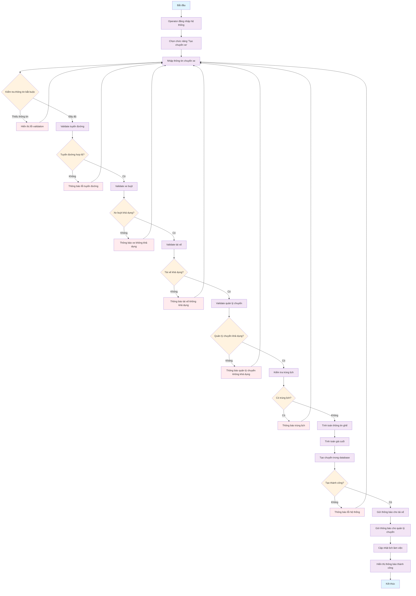
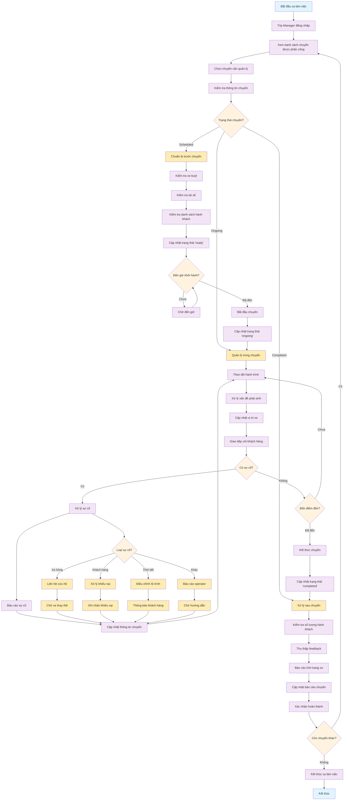
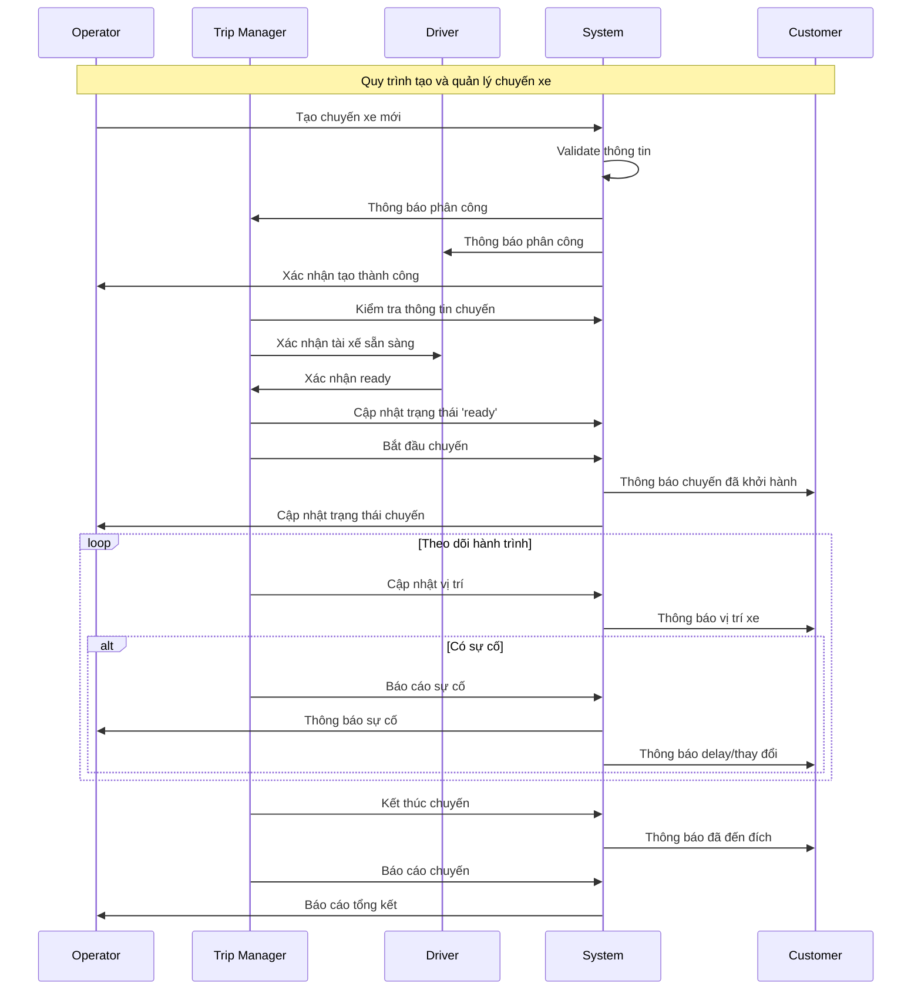

# ACTIVITY DIAGRAMS - QUẢN LÝ CHUYẾN XE

## 1. Activity Diagram - Quy trình tạo chuyến của nhà xe

### Mô tả chi tiết quy trình:

**1. Khởi tạo:**
- Operator đăng nhập và truy cập chức năng tạo chuyến xe
- Hệ thống hiển thị form nhập thông tin

**2. Nhập và validate thông tin:**
- Thông tin bắt buộc: Tuyến đường, Xe buýt, Tài xế, Quản lý chuyến, Thời gian khởi hành/đến
- Validate từng thành phần một cách tuần tự

**3. Kiểm tra tài nguyên:**
- Tuyến đường phải thuộc về operator và đang hoạt động
- Xe buýt phải khả dụng và có sơ đồ ghế
- Tài xế phải có giấy phép còn hạn và đang hoạt động
- Quản lý chuyến phải đang hoạt động

**4. Kiểm tra trùng lịch:**
- Kiểm tra xe buýt không bị trùng lịch
- Kiểm tra tài xế không bị trùng ca
- Kiểm tra quản lý chuyến không bị trùng ca

**5. Tạo chuyến:**
- Tính toán số ghế từ sơ đồ xe buýt
- Tính giá cuối từ giá gốc và discount
- Lưu vào database với trạng thái 'scheduled'

**6. Thông báo:**
- Gửi notification cho tài xế và quản lý chuyến
- Cập nhật lịch làm việc của nhân viên

---

## 2. Activity Diagram - Quy trình làm việc của Trip Manager

### Mô tả chi tiết quy trình Trip Manager:

**1. Bắt đầu ca làm việc:**
- Trip Manager đăng nhập hệ thống
- Xem danh sách các chuyến được phân công trong ngày
- Chọn chuyến cần quản lý

**2. Chuẩ bị trước chuyến (Scheduled):**
- Kiểm tra tình trạng xe buýt (nhiên liệu, vệ sinh, an toàn)
- Xác nhận tài xế có mặt và sẵn sàng
- Kiểm tra danh sách hành khách và vé
- Cập nhật trạng thái chuyến thành 'ready'
- Chờ đến giờ khởi hành và bắt đầu chuyến

**3. Quản lý trong chuyến (Ongoing):**
- Theo dõi hành trình và vị trí xe
- Xử lý các vấn đề phát sinh
- Cập nhật vị trí xe theo thời gian thực
- Giao tiếp với khách hàng khi cần thiết
- Xử lý sự cố nếu có

**4. Xử lý sự cố:**
- **Xe hỏng:** Liên hệ cứu hộ, chờ xe thay thế
- **Khách hàng:** Xử lý khiếu nại, ghi nhận feedback
- **Thời tiết:** Điều chỉnh lộ trình, thông báo khách hàng
- **Khác:** Báo cáo operator và chờ hướng dẫn

**5. Kết thúc chuyến (Completed):**
- Kiểm tra số lượng hành khách xuống xe
- Thu thập feedback từ khách hàng
- Báo cáo tình trạng xe sau chuyến
- Cập nhật báo cáo chuyến đi
- Xác nhận hoàn thành chuyến

**6. Lặp lại:**
- Nếu còn chuyến khác trong ca, quay lại bước 3
- Nếu hết chuyến, kết thúc ca làm việc

---

## 3. Sơ đồ tương tác giữa các Actor

Các Activity Diagrams này mô tả chi tiết quy trình tạo chuyến của nhà xe và quy trình làm việc của Trip Manager, bao gồm tất cả các bước validation, xử lý sự cố và tương tác giữa các thành phần trong hệ thống.