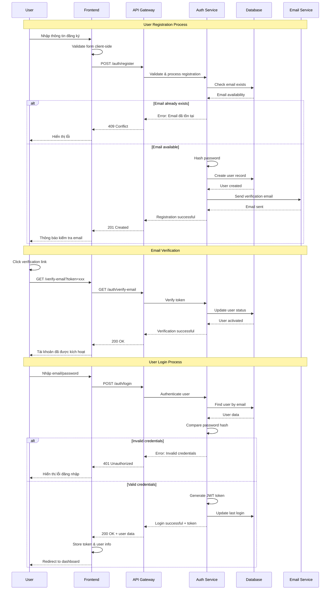
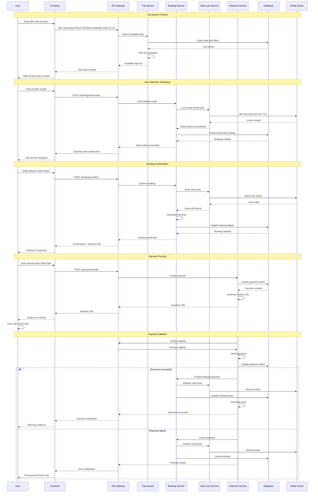
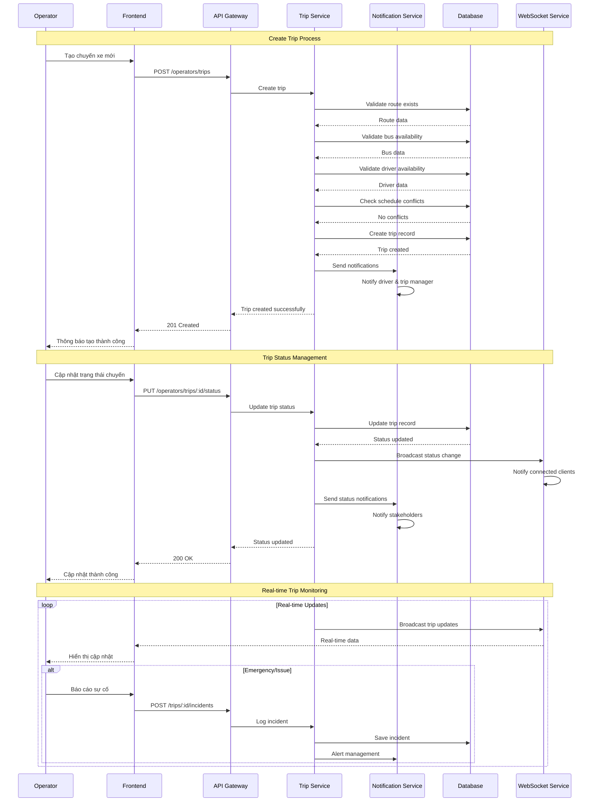
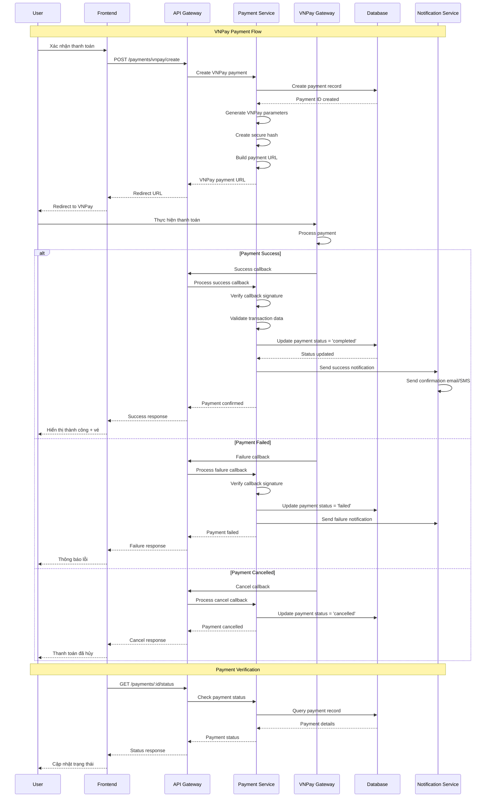
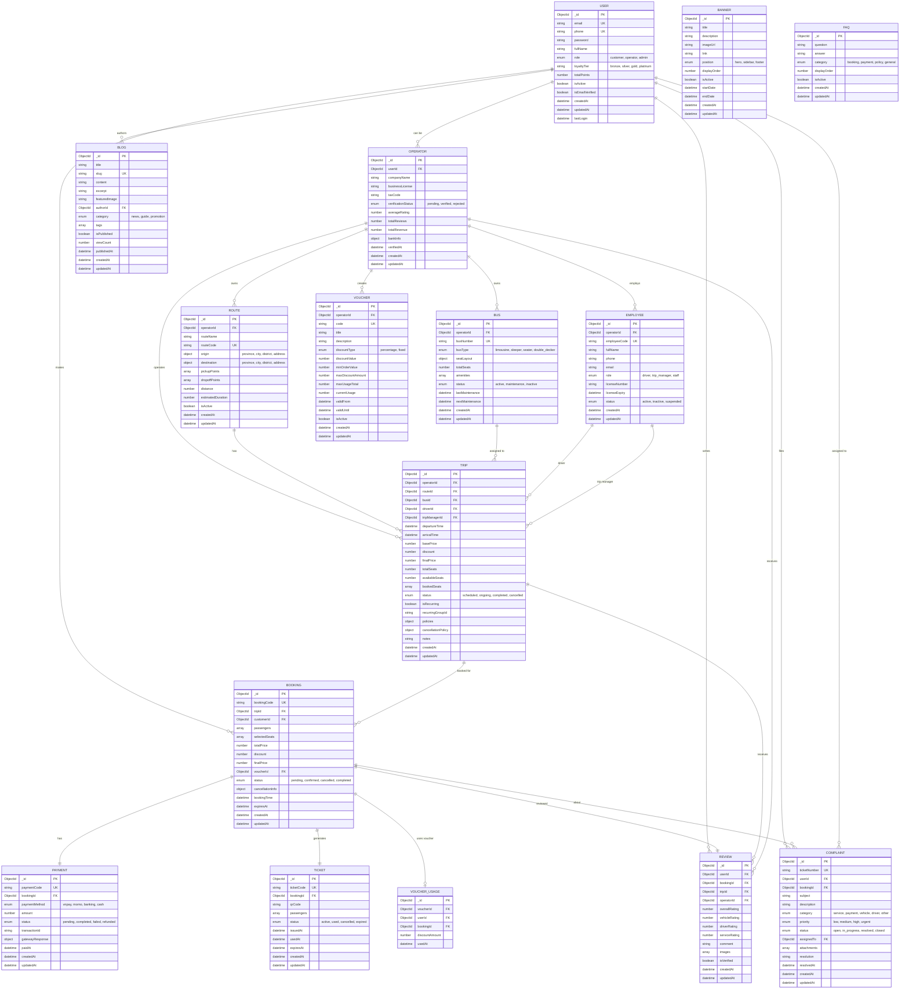

# CHƯƠNG 2. THIẾT KẾ HỆ THỐNG

## 2.1. Thiết kế kiến trúc tổng thể

### 2.1.1. Tổng quan kiến trúc hệ thống

Hệ thống đặt vé xe buýt QuikRide được thiết kế theo mô hình kiến trúc phân lớp (Layered Architecture) kết hợp với Microservices để đảm bảo tính mở rộng, bảo trì và hiệu suất cao. Kiến trúc được chia thành 6 lớp chính:

#### **Lớp 1: Client Layer (Lớp Giao Diện Người Dùng)**

**Web Application (React.js)**
- Giao diện chính cho khách hàng đặt vé
- Responsive design tương thích với mọi thiết bị
- Progressive Web App (PWA) hỗ trợ offline
- Real-time updates thông qua WebSocket

**Mobile Application (React Native)**
- Ứng dụng di động cross-platform
- Push notifications cho cập nhật đặt vé
- GPS tracking cho theo dõi chuyến xe
- Offline booking với sync khi có mạng

**Admin Dashboard (React.js)**
- Giao diện quản trị cho admin hệ thống
- Analytics và reporting dashboard
- User management và system monitoring
- Real-time system health monitoring

**Operator Dashboard (React.js)**
- Giao diện quản lý cho nhà xe
- Trip management và scheduling
- Revenue analytics và reporting
- Driver và vehicle management

#### **Lớp 2: Load Balancer & API Gateway**

**Load Balancer (Nginx)**
- Phân phối tải đều giữa các server instances
- SSL termination và HTTPS redirect
- Static file serving và caching
- Health check và failover tự động
- Rate limiting để chống DDoS

**API Gateway (Express.js)**
- Single entry point cho tất cả API requests
- Authentication và authorization centralized
- Request/response transformation
- API versioning và backward compatibility
- Logging và monitoring tất cả requests

#### **Lớp 3: Application Services Layer**

**Authentication Service**
- JWT token generation và validation
- Multi-factor authentication (MFA)
- OAuth 2.0 integration với social login
- Session management với Redis
- Password reset và email verification

**Booking Service**
- Core business logic cho đặt vé
- Seat selection và temporary locking
- Booking confirmation và cancellation
- Integration với Payment Service
- Real-time seat availability updates

**Payment Service**
- Multiple payment gateway integration (VNPay, MoMo)
- Payment processing và callback handling
- Refund management và dispute resolution
- Transaction logging và audit trail
- PCI DSS compliance

**Trip Management Service**
- Trip scheduling và route management
- Bus và driver assignment
- Real-time trip tracking
- Trip status updates và notifications
- Dynamic pricing algorithms

**Notification Service**
- Multi-channel notifications (Email, SMS, Push)
- Template-based messaging
- Delivery status tracking
- Notification preferences management
- Real-time WebSocket notifications

#### **Lớp 4: Business Logic & Support Services**

**Seat Lock Service (Redis)**
- Temporary seat reservations (15 phút)
- Distributed locking mechanism
- Lock expiration và cleanup
- Concurrent booking prevention
- Real-time seat status broadcasting

**Voucher Service**
- Discount code generation và validation
- Usage tracking và limits enforcement
- Expiration management
- Bulk voucher operations
- Integration với Loyalty Service

**Loyalty Service**
- Points accumulation và redemption
- Tier management (Bronze, Silver, Gold, Platinum)
- Reward calculation algorithms
- Member benefits management
- Gamification features

**Reporting Service**
- Business intelligence và analytics
- Revenue reporting và forecasting
- Performance metrics tracking
- Custom report generation
- Data export capabilities

#### **Lớp 5: Data Layer**

**MongoDB (Primary Database)**
- Document-based storage cho flexibility
- Horizontal scaling với sharding
- Replica sets cho high availability
- Aggregation pipeline cho complex queries
- GridFS cho file storage

**Redis (Cache & Sessions)**
- Session storage cho user authentication
- Application-level caching
- Real-time data như seat locks
- Pub/Sub cho real-time notifications
- Rate limiting counters

**AWS S3 (File Storage)**
- Static assets (images, documents)
- Backup storage cho database dumps
- CDN integration cho fast delivery
- Versioning và lifecycle management
- Security với IAM policies

#### **Lớp 6: External Services Integration**

**VNPay Gateway**
- Primary payment processor tại Việt Nam
- Secure payment processing
- Multiple payment methods support
- Real-time transaction status
- Webhook callbacks cho payment updates

**SMS Provider (Twilio/SMSAPI)**
- OTP delivery cho authentication
- Booking confirmations và updates
- Emergency notifications
- Delivery status tracking
- International SMS support

**Email Service (SendGrid/AWS SES)**
- Transactional emails (confirmations, receipts)
- Marketing campaigns
- Template management
- Bounce và complaint handling
- Analytics và tracking

**Google Maps API**
- Route calculation và optimization
- Real-time traffic data
- Geocoding cho addresses
- Distance matrix calculations
- Places API cho location search

### 2.1.2. Kiến trúc Microservices

#### **Nguyên tắc thiết kế Microservices**

**Domain-Driven Design (DDD)**
- Mỗi service quản lý một business domain cụ thể
- Bounded contexts rõ ràng giữa các services
- Shared kernel tối thiểu để giảm coupling
- Event-driven communication giữa services

**Service Independence**
- Mỗi service có database riêng biệt
- Independent deployment và scaling
- Technology stack flexibility
- Fault isolation và resilience

**API-First Approach**
- Well-defined API contracts
- Versioning strategy cho backward compatibility
- Documentation với OpenAPI/Swagger
- Contract testing giữa services

#### **Core Services**

**User Service**
- User registration, authentication, và profile management
- Role-based access control (RBAC)
- Social login integration
- User preferences và settings
- Account verification và security

**Booking Service**
- Seat selection và reservation logic
- Booking lifecycle management
- Integration với Payment và Notification services
- Cancellation và refund processing
- Booking history và analytics

**Trip Service**
- Trip creation và scheduling
- Route và bus management
- Driver assignment và tracking
- Real-time location updates
- Trip performance analytics

**Payment Service**
- Payment gateway abstraction
- Transaction processing và reconciliation
- Refund và chargeback handling
- Payment method management
- Financial reporting

**Notification Service**
- Multi-channel notification delivery
- Template management và personalization
- Delivery tracking và retry logic
- User preference management
- Real-time push notifications

#### **Support Services**

**Seat Lock Service**
- Distributed seat locking với Redis
- Lock timeout và cleanup mechanisms
- Concurrent access handling
- Real-time seat availability broadcasting
- Performance optimization cho high concurrency

**Loyalty Service**
- Points calculation và tier management
- Reward redemption logic
- Member benefit calculations
- Gamification features
- Integration với Booking Service

**Reporting Service**
- Data aggregation từ multiple services
- Real-time analytics dashboard
- Scheduled report generation
- Custom query builder
- Data export và visualization

**File Service**
- Document upload và processing
- Image resizing và optimization
- Virus scanning và security checks
- CDN integration
- Backup và archival

### 2.1.3. Kiến trúc bảo mật

#### **Network Security**

**Web Application Firewall (WAF)**
- Protection against OWASP Top 10 vulnerabilities
- SQL injection và XSS prevention
- Rate limiting và DDoS protection
- Geo-blocking cho suspicious regions
- Custom rules cho business logic protection

**SSL/TLS Encryption**
- End-to-end encryption cho all communications
- Certificate management với auto-renewal
- Perfect Forward Secrecy (PFS)
- HSTS headers cho browser security
- Certificate pinning cho mobile apps

#### **Authentication & Authorization**

**JWT Tokens**
- Stateless authentication với signed tokens
- Short-lived access tokens (15 phút)
- Refresh token rotation
- Token blacklisting cho logout
- Secure token storage practices

**Role-Based Access Control (RBAC)**
- Granular permissions system
- Role hierarchy và inheritance
- Dynamic permission checking
- Audit trail cho access attempts
- Principle of least privilege

**Multi-Factor Authentication (MFA)**
- SMS-based OTP verification
- Time-based OTP (TOTP) support
- Backup codes cho recovery
- Risk-based authentication
- Device trust management

#### **Data Security**

**Encryption at Rest**
- Database encryption với AES-256
- File encryption trên S3
- Key management với AWS KMS
- Regular key rotation
- Secure key storage practices

**Password Security**
- bcrypt hashing với high cost factor
- Password complexity requirements
- Breach detection và forced resets
- Secure password recovery
- Password history tracking

**Data Privacy**
- GDPR compliance implementation
- Data minimization principles
- Right to be forgotten
- Data anonymization techniques
- Privacy by design approach

#### **API Security**

**Input Validation**
- Schema-based validation
- Sanitization của user inputs
- File upload restrictions
- SQL injection prevention
- XSS protection

**Rate Limiting**
- Per-user và per-IP rate limits
- Sliding window algorithms
- Burst protection
- API quota management
- Graceful degradation

#### **Monitoring & Compliance**

**Security Monitoring**
- Real-time threat detection
- Anomaly detection algorithms
- Security incident response
- Automated alerting systems
- Forensic logging capabilities

**Audit Logging**
- Comprehensive audit trails
- Immutable log storage
- Log integrity verification
- Compliance reporting
- Real-time log analysis

**Compliance Standards**
- PCI DSS cho payment processing
- GDPR cho data protection
- ISO 27001 security standards
- Regular security assessments
- Third-party security audits

---

## 2.3. Sequence Diagram

### 2.3.1. Sequence Diagram - Quy trình đăng ký và đăng nhập



### 2.3.2. Sequence Diagram - Quy trình tìm kiếm và đặt vé



### 2.3.3. Sequence Diagram - Quy trình quản lý chuyến xe



### 2.3.4. Sequence Diagram - Quy trình thanh toán VNPay



---

## 2.4. Thiết kế cơ sở dữ liệu

### 2.4.1. Sơ đồ ERD (Entity Relationship Diagram)



### 2.4.2. Thiết kế Collection MongoDB

#### Collection: users
```javascript
{
  _id: ObjectId,
  email: String, // unique, required
  phone: String, // unique, sparse
  password: String, // hashed with bcrypt
  fullName: String,
  avatar: String, // URL to profile image
  dateOfBirth: Date,
  gender: String, // enum: ['male', 'female', 'other']
  role: String, // enum: ['customer', 'operator', 'admin']
  
  // Loyalty Program
  loyaltyTier: String, // enum: ['bronze', 'silver', 'gold', 'platinum']
  totalPoints: Number, // default: 0
  pointsHistory: [{
    amount: Number,
    type: String, // enum: ['earned', 'redeemed', 'expired']
    description: String,
    createdAt: Date
  }],
  
  // Account Status
  isActive: Boolean, // default: true
  isEmailVerified: Boolean, // default: false
  isPhoneVerified: Boolean, // default: false
  
  // Security
  emailVerificationToken: String,
  emailVerificationExpires: Date,
  passwordResetToken: String,
  passwordResetExpires: Date,
  
  // Preferences
  preferences: {
    language: String, // default: 'vi'
    currency: String, // default: 'VND'
    notifications: {
      email: Boolean, // default: true
      sms: Boolean, // default: true
      push: Boolean // default: true
    }
  },
  
  // Timestamps
  lastLogin: Date,
  createdAt: Date,
  updatedAt: Date
}
```

#### Collection: trips
```javascript
{
  _id: ObjectId,
  operatorId: ObjectId, // ref: 'Operator'
  routeId: ObjectId, // ref: 'Route'
  busId: ObjectId, // ref: 'Bus'
  driverId: ObjectId, // ref: 'Employee'
  tripManagerId: ObjectId, // ref: 'Employee'
  
  // Schedule
  departureTime: Date,
  arrivalTime: Date,
  
  // Pricing
  basePrice: Number,
  discount: Number, // percentage (0-100)
  finalPrice: Number, // calculated field
  
  // Dynamic Pricing (optional)
  dynamicPricing: {
    enabled: Boolean,
    rules: [{
      condition: String, // 'occupancy_rate', 'days_before', 'time_of_day'
      operator: String, // 'gt', 'lt', 'eq', 'between'
      value: Mixed, // threshold value
      adjustment: Number, // percentage adjustment
      priority: Number // rule priority
    }]
  },
  
  // Seat Management
  totalSeats: Number,
  availableSeats: Number,
  bookedSeats: [{
    seatNumber: String,
    bookingId: ObjectId,
    passengerName: String,
    bookedAt: Date
  }],
  
  // Status
  status: String, // enum: ['scheduled', 'ongoing', 'completed', 'cancelled']
  
  // Recurring Trip Info
  isRecurring: Boolean, // default: false
  recurringGroupId: String, // UUID for grouping recurring trips
  
  // Policies
  policies: {
    cancellationPolicy: {
      allowCancellation: Boolean,
      freeUntilHours: Number, // hours before departure
      refundPercentage: [{
        hoursBeforeDeparture: Number,
        refundPercent: Number
      }]
    },
    baggage: {
      allowedWeight: Number, // kg
      extraFeePerKg: Number
    },
    children: {
      freeAgeLimit: Number, // children under this age travel free
      discountAgeLimit: Number, // children under this age get discount
      discountPercent: Number
    }
  },
  
  // Trip Details
  notes: String, // special instructions
  amenities: [String], // inherited from bus but can be overridden
  
  // Cancellation Info (if cancelled)
  cancelledAt: Date,
  cancelReason: String,
  cancelledBy: ObjectId, // ref: 'User'
  
  // Timestamps
  createdAt: Date,
  updatedAt: Date
}
```

#### Collection: bookings
```javascript
{
  _id: ObjectId,
  bookingCode: String, // unique, auto-generated (e.g., "BUS240115001")
  
  // References
  tripId: ObjectId, // ref: 'Trip'
  customerId: ObjectId, // ref: 'User', can be null for guest bookings
  
  // Guest Booking Info (if customerId is null)
  guestInfo: {
    fullName: String,
    phone: String,
    email: String
  },
  
  // Passenger Information
  passengers: [{
    fullName: String,
    phone: String,
    email: String,
    idNumber: String, // CCCD/CMND
    dateOfBirth: Date,
    gender: String,
    seatNumber: String,
    ticketType: String // enum: ['adult', 'child', 'infant']
  }],
  
  // Seat Selection
  selectedSeats: [String], // array of seat numbers
  
  // Pricing
  totalPrice: Number, // base price * number of seats
  discount: Number, // discount amount (not percentage)
  finalPrice: Number, // total after discount
  
  // Voucher
  voucherId: ObjectId, // ref: 'Voucher'
  voucherDiscount: Number,
  
  // Loyalty Points
  pointsEarned: Number,
  pointsUsed: Number,
  
  // Booking Status
  status: String, // enum: ['pending', 'confirmed', 'cancelled', 'completed', 'no_show']
  
  // Timing
  bookingTime: Date,
  expiresAt: Date, // booking expires if not paid within time limit
  confirmedAt: Date,
  
  // Cancellation
  cancellationInfo: {
    cancelledAt: Date,
    cancelReason: String,
    refundAmount: Number,
    refundStatus: String, // enum: ['pending', 'processed', 'failed']
    refundedAt: Date
  },
  
  // Contact Preferences
  contactPreferences: {
    smsUpdates: Boolean,
    emailUpdates: Boolean
  },
  
  // Special Requests
  specialRequests: String,
  
  // Timestamps
  createdAt: Date,
  updatedAt: Date
}
```

### 2.4.3. Indexes và Performance Optimization

#### Indexes Strategy
```javascript
// Users Collection
db.users.createIndex({ email: 1 }, { unique: true })
db.users.createIndex({ phone: 1 }, { sparse: true, unique: true })
db.users.createIndex({ role: 1, isActive: 1 })

// Trips Collection
db.trips.createIndex({ operatorId: 1, departureTime: 1 })
db.trips.createIndex({ "routeId": 1, "departureTime": 1, "status": 1 })
db.trips.createIndex({ departureTime: 1, status: 1 })
db.trips.createIndex({ recurringGroupId: 1 })

// Bookings Collection
db.bookings.createIndex({ bookingCode: 1 }, { unique: true })
db.bookings.createIndex({ customerId: 1, createdAt: -1 })
db.bookings.createIndex({ tripId: 1, status: 1 })
db.bookings.createIndex({ status: 1, expiresAt: 1 })

// Payments Collection
db.payments.createIndex({ paymentCode: 1 }, { unique: true })
db.payments.createIndex({ bookingId: 1 })
db.payments.createIndex({ status: 1, createdAt: -1 })

// Routes Collection
db.routes.createIndex({ operatorId: 1, isActive: 1 })
db.routes.createIndex({ "origin.city": 1, "destination.city": 1 })

// Reviews Collection
db.reviews.createIndex({ operatorId: 1, createdAt: -1 })
db.reviews.createIndex({ tripId: 1 })
db.reviews.createIndex({ userId: 1, bookingId: 1 }, { unique: true })
```

#### Sharding Strategy (for scale)
```javascript
// Shard key for trips collection (high write volume)
sh.shardCollection("busBooking.trips", { "operatorId": 1, "departureTime": 1 })

// Shard key for bookings collection
sh.shardCollection("busBooking.bookings", { "customerId": 1, "createdAt": 1 })

// Shard key for payments collection
sh.shardCollection("busBooking.payments", { "bookingId": 1 })
```

### 2.4.4. Data Archival Strategy

```javascript
// Archive old completed trips (older than 2 years)
const archiveTrips = {
  source: "trips",
  destination: "trips_archive",
  criteria: {
    status: "completed",
    departureTime: { $lt: new Date(Date.now() - 2 * 365 * 24 * 60 * 60 * 1000) }
  }
}

// Archive old bookings (older than 3 years)
const archiveBookings = {
  source: "bookings", 
  destination: "bookings_archive",
  criteria: {
    status: { $in: ["completed", "cancelled"] },
    createdAt: { $lt: new Date(Date.now() - 3 * 365 * 24 * 60 * 60 * 1000) }
  }
}
```

Thiết kế cơ sở dữ liệu này đảm bảo:
1. **Scalability**: Sharding và indexing phù hợp
2. **Performance**: Indexes tối ưu cho các query thường dùng
3. **Data Integrity**: Proper relationships và constraints
4. **Flexibility**: Schema linh hoạt cho future requirements
5. **Archival**: Strategy để quản lý dữ liệu cũ