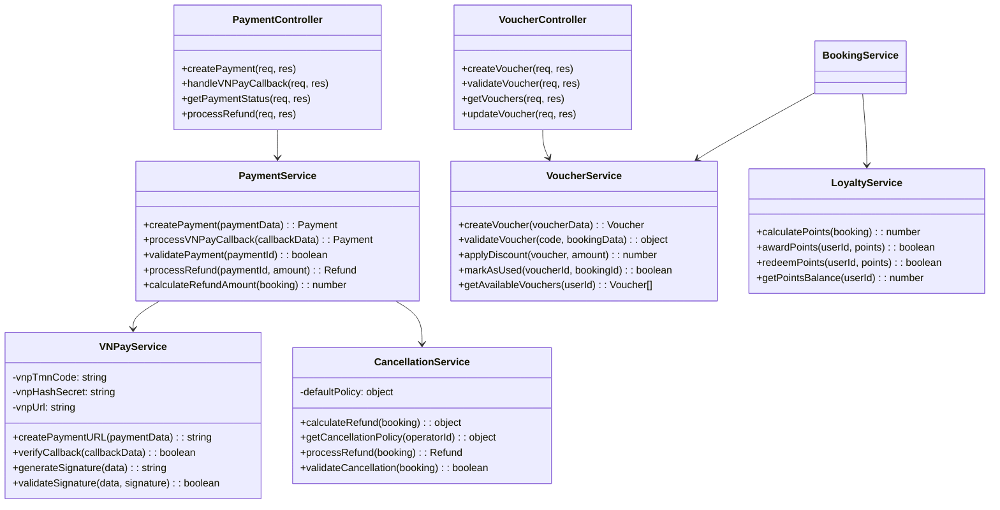

# Sơ Đồ Lớp (Class Diagram) - Hệ Thống Đặt Vé Xe Buýt

## Sơ Đồ Tổng Quan

## Sơ Đồ Chi Tiết Theo Module

### 1. Authentication & User Management Module

### 2. Booking & Trip Management Module

### 3. Payment & Financial Module

### 4. Ticket & Document Generation Module

### 5. Communication & Notification Module

### 6. System & Utility Module

## Mối Quan Hệ Chính

### Dependency Flow
1. **Controllers** → **Services** (Sử dụng business logic)
2. **Services** → **Other Services** (Phụ thuộc chức năng)
3. **Services** → **Models** (Tương tác database)
4. **Services** → **Utilities** (Sử dụng tiện ích)

### Key Dependencies
- `BookingService` phụ thuộc vào `SeatLockService`, `VoucherService`, `PaymentService`
- `PaymentService` phụ thuộc vào `VNPayService`, `TicketService`, `NotificationService`
- `TicketService` phụ thuộc vào `QRService`, `PDFService`
- `NotificationService` phụ thuộc vào `SMSService`

### Circular Dependency Prevention
- Sử dụng lazy loading cho các service có thể gây circular dependency
- Tách interface và implementation khi cần thiết
- Sử dụng dependency injection pattern

## Đặc Điểm Thiết Kế

1. **Layered Architecture**: Controller → Service → Model
2. **Single Responsibility**: Mỗi class có một trách nhiệm cụ thể
3. **Dependency Injection**: Services được inject vào controllers
4. **Error Handling**: Centralized error handling với AppError
5. **Real-time Updates**: WebSocket cho cập nhật trạng thái
6. **Security**: Encryption, JWT, OTP validation
7. **Scalability**: Redis cho caching và session management