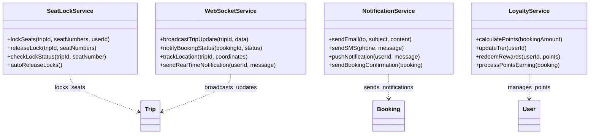

# Sơ Đồ Lớp Chi Tiết - Hệ Thống QuikRide Bus Booking

## 1. Sơ Đồ Lớp Tổng Quan

## 2. Sơ Đồ Lớp Theo Nhóm Chức Năng

### 2.1. Nhóm Quản Lý Người Dùng

### 2.2. Nhóm Hệ Thống Vận Chuyển

### 2.3. Nhóm Hệ Thống Đặt Vé

### 2.4. Nhóm Dịch Vụ Hỗ Trợ

## 3. Sơ Đồ Luồng Tương Tác Chính

### 3.1. Luồng Đặt Vé

### 3.2. Luồng Quản Lý Chuyến

## 4. Ghi Chú Thiết Kế

### Nguyên Tắc Thiết Kế:
1. **Single Responsibility**: Mỗi lớp có một trách nhiệm duy nhất
2. **Encapsulation**: Thuộc tính private (-), phương thức public (+)
3. **Dependency Injection**: Services được inject vào controllers
4. **Observer Pattern**: WebSocketService để thông báo real-time
5. **Strategy Pattern**: Payment methods, notification channels

### Quan Hệ Chính:
- **Composition**: Booking có Payment và Ticket
- **Aggregation**: Operator có nhiều Employee, Route, Bus
- **Association**: User tạo nhiều Booking
- **Dependency**: Services phụ thuộc vào domain objects