# Sơ Đồ Hệ Thống QuikRide Bus Booking

## 1. Kiến Trúc Tổng Quan

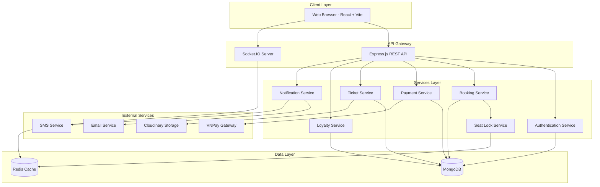
```mermaid
graph TB
    subgraph "Client Layer"
        WEB[Web Browser - React + Vite]
    end

    subgraph "API Gateway"
        API[Express.js REST API]
        SOCKET[Socket.IO Server]
    end

    subgraph "Services Layer"
        AUTH[Authentication Service]
        BOOKING[Booking Service]
        PAYMENT[Payment Service]
        TICKET[Ticket Service]
        LOYALTY[Loyalty Service]
        NOTIFICATION[Notification Service]
        SEATLOCK[Seat Lock Service]
    end

    subgraph "Data Layer"
        MONGO[(MongoDB)]
        REDIS[(Redis Cache)]
    end

    subgraph "External Services"
        VNPAY[VNPay Gateway]
        CLOUDINARY[Cloudinary Storage]
        EMAIL[Email Service]
        SMS[SMS Service]
    end

    WEB --> API
    WEB --> SOCKET
    API --> AUTH
    API --> BOOKING
    API --> PAYMENT
    API --> TICKET
    API --> LOYALTY
    API --> NOTIFICATION

    BOOKING --> SEATLOCK
    SEATLOCK --> REDIS

    AUTH --> MONGO
    BOOKING --> MONGO
    PAYMENT --> MONGO
    TICKET --> MONGO
    LOYALTY --> MONGO

    PAYMENT --> VNPAY
    NOTIFICATION --> EMAIL
    NOTIFICATION --> SMS
    TICKET --> CLOUDINARY

    SOCKET --> REDIS
```

## 2. Phân Quyền Người Dùng

```mermaid
graph TD
    USERS[Users] --> CUSTOMER[Customer/Guest]
    USERS --> OPERATOR[Bus Operator]
    USERS --> TRIPMGR[Trip Manager]
    USERS --> ADMIN[Admin]

    CUSTOMER --> |Search & Book| SEARCH[Search Trips]
    CUSTOMER --> |Manage| MYTICKETS[My Tickets]
    CUSTOMER --> |Earn| LOYALTY[Loyalty Points]
    CUSTOMER --> |Review| REVIEW[Review & Rating]
    CUSTOMER --> |Report| COMPLAINT[Complaints]

    OPERATOR --> |Manage| ROUTES[Routes Management]
    OPERATOR --> |Manage| BUSES[Buses Management]
    OPERATOR --> |Schedule| TRIPS[Trips Scheduling]
    OPERATOR --> |Manage| EMPLOYEES[Employee Management]
    OPERATOR --> |Create| VOUCHERS[Vouchers]
    OPERATOR --> |View| REPORTS[Revenue Reports]

    TRIPMGR --> |View| DASHBOARD[Active Trips Dashboard]
    TRIPMGR --> |Scan| QRSCANNER[QR Code Scanner]
    TRIPMGR --> |Update| STATUS[Journey Status]
    TRIPMGR --> |Track| PASSENGERS[Passenger List]

    ADMIN --> |Verify| OPERATORS[Operator Verification]
    ADMIN --> |Manage| ALLUSERS[User Management]
    ADMIN --> |Handle| COMPLAINTS[Complaint Resolution]
    ADMIN --> |Manage| CONTENT[Content Management]
    ADMIN --> |View| SYSREPORTS[System Reports]
```

## 3. Luồng Đặt Vé Của Khách Hàng

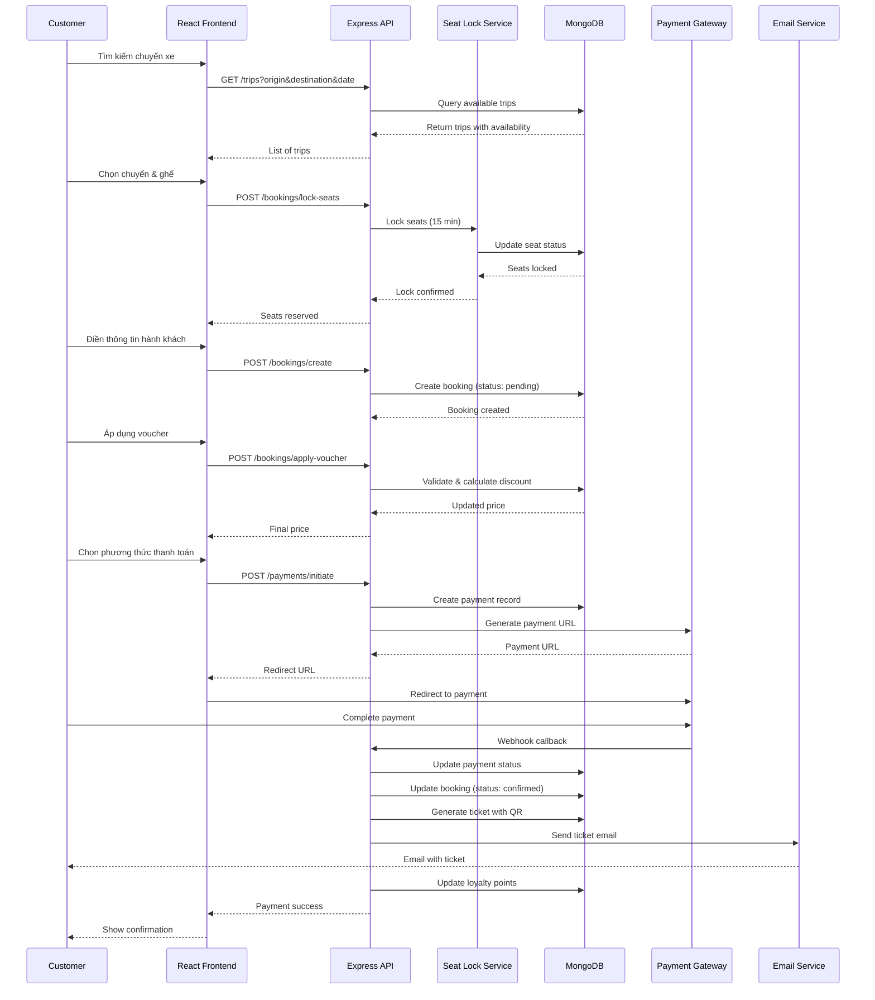
```mermaid
sequenceDiagram
    participant C as Customer
    participant UI as React Frontend
    participant API as Express API
    participant LOCK as Seat Lock Service
    participant DB as MongoDB
    participant PAY as Payment Gateway
    participant EMAIL as Email Service

    C->>UI: Tìm kiếm chuyến xe
    UI->>API: GET /trips?origin&destination&date
    API->>DB: Query available trips
    DB-->>API: Return trips with availability
    API-->>UI: List of trips

    C->>UI: Chọn chuyến & ghế
    UI->>API: POST /bookings/lock-seats
    API->>LOCK: Lock seats (15 min)
    LOCK->>DB: Update seat status
    DB-->>LOCK: Seats locked
    LOCK-->>API: Lock confirmed
    API-->>UI: Seats reserved

    C->>UI: Điền thông tin hành khách
    UI->>API: POST /bookings/create
    API->>DB: Create booking (status: pending)
    DB-->>API: Booking created

    C->>UI: Áp dụng voucher
    UI->>API: POST /bookings/apply-voucher
    API->>DB: Validate & calculate discount
    DB-->>API: Updated price
    API-->>UI: Final price

    C->>UI: Chọn phương thức thanh toán
    UI->>API: POST /payments/initiate
    API->>DB: Create payment record
    API->>PAY: Generate payment URL
    PAY-->>API: Payment URL
    API-->>UI: Redirect URL

    UI->>PAY: Redirect to payment
    C->>PAY: Complete payment
    PAY->>API: Webhook callback
    API->>DB: Update payment status
    API->>DB: Update booking (status: confirmed)

    API->>DB: Generate ticket with QR
    API->>EMAIL: Send ticket email
    EMAIL-->>C: Email with ticket

    API->>DB: Update loyalty points
    API-->>UI: Payment success
    UI-->>C: Show confirmation
```

## 4. Luồng Quản Lý Chuyến Đi (Trip Manager)

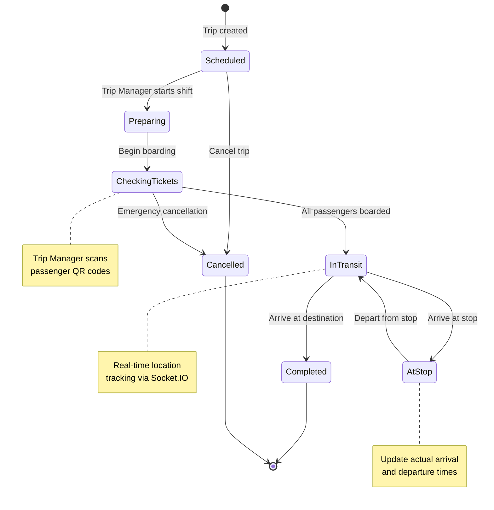
```mermaid
stateDiagram-v2
    [*] --> Scheduled: Trip created

    Scheduled --> Preparing: Trip Manager starts shift
    Preparing --> CheckingTickets: Begin boarding
    CheckingTickets --> InTransit: All passengers boarded

    InTransit --> AtStop: Arrive at stop
    AtStop --> InTransit: Depart from stop
    InTransit --> Completed: Arrive at destination

    Scheduled --> Cancelled: Cancel trip
    CheckingTickets --> Cancelled: Emergency cancellation

    Completed --> [*]
    Cancelled --> [*]

    note right of CheckingTickets
        Trip Manager scans
        passenger QR codes
    end note

    note right of InTransit
        Real-time location
        tracking via Socket.IO
    end note

    note right of AtStop
        Update actual arrival
        and departure times
    end note
```

## 5. Sơ Đồ Database

### 5.1. Tổng Quan Quan Hệ Database

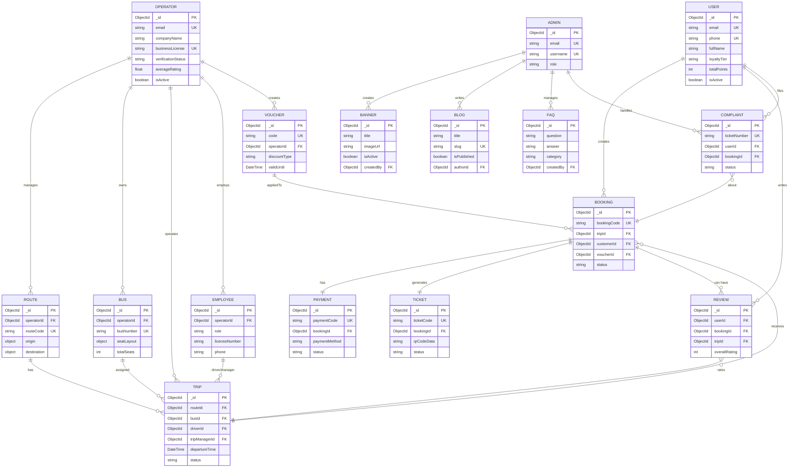
```mermaid
erDiagram
    USER ||--o{ BOOKING : creates
    USER ||--o{ REVIEW : writes
    USER ||--o{ COMPLAINT : files
    USER {
        ObjectId _id PK
        string email UK
        string phone UK
        string fullName
        string loyaltyTier
        int totalPoints
        boolean isActive
    }

    OPERATOR ||--o{ ROUTE : manages
    OPERATOR ||--o{ BUS : owns
    OPERATOR ||--o{ TRIP : operates
    OPERATOR ||--o{ EMPLOYEE : employs
    OPERATOR ||--o{ VOUCHER : creates
    OPERATOR {
        ObjectId _id PK
        string email UK
        string companyName
        string businessLicense UK
        string verificationStatus
        float averageRating
        boolean isActive
    }

    EMPLOYEE ||--o{ TRIP : "driver/manager"
    EMPLOYEE {
        ObjectId _id PK
        ObjectId operatorId FK
        string role
        string licenseNumber
        string phone
    }

    ROUTE ||--o{ TRIP : has
    ROUTE {
        ObjectId _id PK
        ObjectId operatorId FK
        string routeCode UK
        object origin
        object destination
    }

    BUS ||--o{ TRIP : assigned
    BUS {
        ObjectId _id PK
        ObjectId operatorId FK
        string busNumber UK
        object seatLayout
        int totalSeats
    }

    TRIP ||--o{ BOOKING : receives
    TRIP {
        ObjectId _id PK
        ObjectId routeId FK
        ObjectId busId FK
        ObjectId driverId FK
        ObjectId tripManagerId FK
        DateTime departureTime
        string status
    }

    BOOKING ||--|| PAYMENT : has
    BOOKING ||--|| TICKET : generates
    BOOKING ||--o{ REVIEW : "can have"
    BOOKING {
        ObjectId _id PK
        string bookingCode UK
        ObjectId tripId FK
        ObjectId customerId FK
        ObjectId voucherId FK
        string status
    }

    PAYMENT {
        ObjectId _id PK
        string paymentCode UK
        ObjectId bookingId FK
        string paymentMethod
        string status
    }

    TICKET {
        ObjectId _id PK
        string ticketCode UK
        ObjectId bookingId FK
        string qrCodeData
        string status
    }

    VOUCHER ||--o{ BOOKING : appliedTo
    VOUCHER {
        ObjectId _id PK
        string code UK
        ObjectId operatorId FK
        string discountType
        DateTime validUntil
    }

    REVIEW }o--|| TRIP : rates
    REVIEW {
        ObjectId _id PK
        ObjectId userId FK
        ObjectId bookingId FK
        ObjectId tripId FK
        int overallRating
    }

    COMPLAINT }o--|| BOOKING : about
    COMPLAINT {
        ObjectId _id PK
        string ticketNumber UK
        ObjectId userId FK
        ObjectId bookingId FK
        string status
    }

    ADMIN ||--o{ BANNER : creates
    ADMIN ||--o{ BLOG : writes
    ADMIN ||--o{ FAQ : manages
    ADMIN ||--o{ COMPLAINT : handles

    ADMIN {
        ObjectId _id PK
        string email UK
        string username UK
        string role
    }

    BANNER {
        ObjectId _id PK
        string title
        string imageUrl
        boolean isActive
        ObjectId createdBy FK
    }

    BLOG {
        ObjectId _id PK
        string title
        string slug UK
        boolean isPublished
        ObjectId authorId FK
    }

    FAQ {
        ObjectId _id PK
        string question
        string answer
        string category
        ObjectId createdBy FK
    }
```

### 5.2. User Management - Chi Tiết

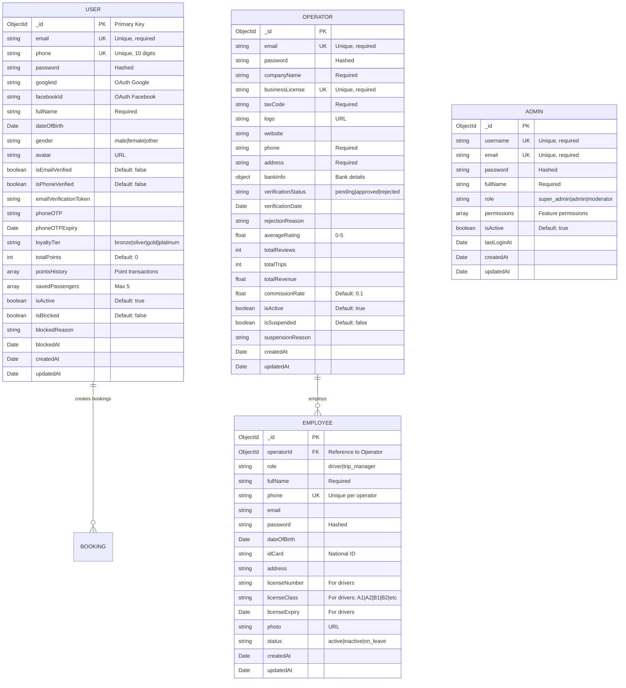
```mermaid
erDiagram
    USER {
        ObjectId _id PK "Primary Key"
        string email UK "Unique, required"
        string phone UK "Unique, 10 digits"
        string password "Hashed"
        string googleId "OAuth Google"
        string facebookId "OAuth Facebook"
        string fullName "Required"
        Date dateOfBirth
        string gender "male|female|other"
        string avatar "URL"
        boolean isEmailVerified "Default: false"
        boolean isPhoneVerified "Default: false"
        string emailVerificationToken
        string phoneOTP
        Date phoneOTPExpiry
        string loyaltyTier "bronze|silver|gold|platinum"
        int totalPoints "Default: 0"
        array pointsHistory "Point transactions"
        array savedPassengers "Max 5"
        boolean isActive "Default: true"
        boolean isBlocked "Default: false"
        string blockedReason
        Date blockedAt
        Date createdAt
        Date updatedAt
    }

    OPERATOR {
        ObjectId _id PK
        string email UK "Unique, required"
        string password "Hashed"
        string companyName "Required"
        string businessLicense UK "Unique, required"
        string taxCode "Required"
        string logo "URL"
        string website
        string phone "Required"
        string address "Required"
        object bankInfo "Bank details"
        string verificationStatus "pending|approved|rejected"
        Date verificationDate
        string rejectionReason
        float averageRating "0-5"
        int totalReviews
        int totalTrips
        float totalRevenue
        float commissionRate "Default: 0.1"
        boolean isActive "Default: true"
        boolean isSuspended "Default: false"
        string suspensionReason
        Date createdAt
        Date updatedAt
    }

    EMPLOYEE {
        ObjectId _id PK
        ObjectId operatorId FK "Reference to Operator"
        string role "driver|trip_manager"
        string fullName "Required"
        string phone UK "Unique per operator"
        string email
        string password "Hashed"
        Date dateOfBirth
        string idCard "National ID"
        string address
        string licenseNumber "For drivers"
        string licenseClass "For drivers: A1|A2|B1|B2|etc"
        Date licenseExpiry "For drivers"
        string photo "URL"
        string status "active|inactive|on_leave"
        Date createdAt
        Date updatedAt
    }

    ADMIN {
        ObjectId _id PK
        string username UK "Unique, required"
        string email UK "Unique, required"
        string password "Hashed"
        string fullName "Required"
        string role "super_admin|admin|moderator"
        array permissions "Feature permissions"
        boolean isActive "Default: true"
        Date lastLoginAt
        Date createdAt
        Date updatedAt
    }

    USER ||--o{ BOOKING : "creates bookings"
    OPERATOR ||--o{ EMPLOYEE : "employs"
```

### 5.3. Transportation System - Chi Tiết

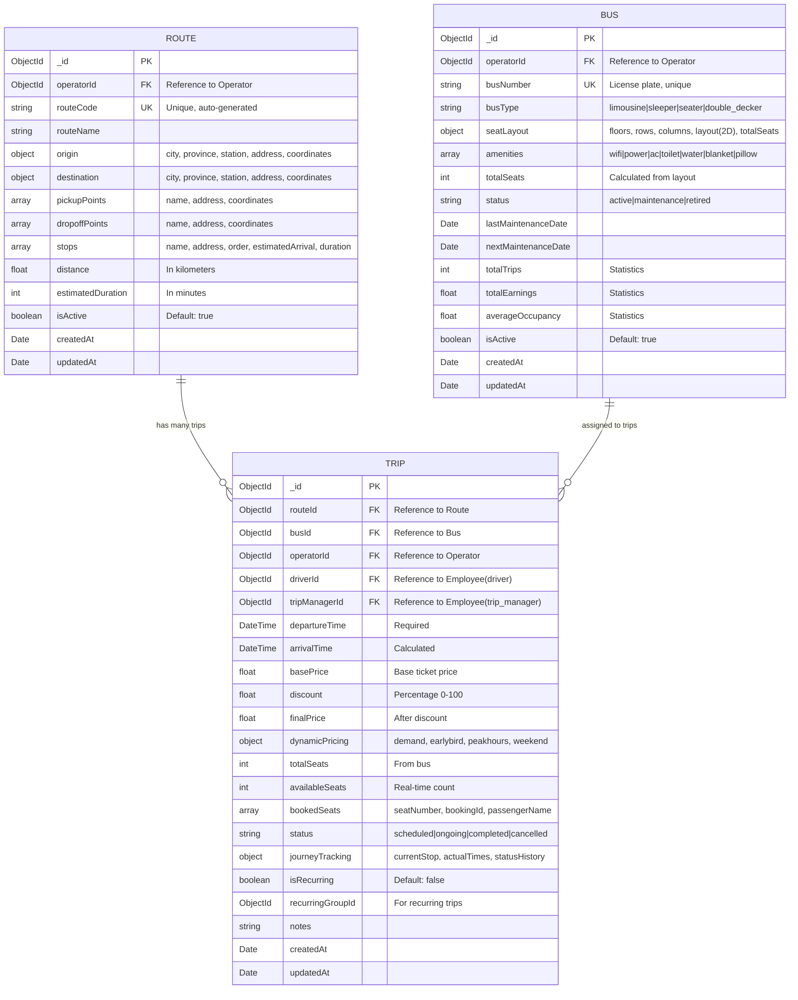
```mermaid
erDiagram
    ROUTE {
        ObjectId _id PK
        ObjectId operatorId FK "Reference to Operator"
        string routeCode UK "Unique, auto-generated"
        string routeName
        object origin "city, province, station, address, coordinates"
        object destination "city, province, station, address, coordinates"
        array pickupPoints "name, address, coordinates"
        array dropoffPoints "name, address, coordinates"
        array stops "name, address, order, estimatedArrival, duration"
        float distance "In kilometers"
        int estimatedDuration "In minutes"
        boolean isActive "Default: true"
        Date createdAt
        Date updatedAt
    }

    BUS {
        ObjectId _id PK
        ObjectId operatorId FK "Reference to Operator"
        string busNumber UK "License plate, unique"
        string busType "limousine|sleeper|seater|double_decker"
        object seatLayout "floors, rows, columns, layout(2D), totalSeats"
        array amenities "wifi|power|ac|toilet|water|blanket|pillow"
        int totalSeats "Calculated from layout"
        string status "active|maintenance|retired"
        Date lastMaintenanceDate
        Date nextMaintenanceDate
        int totalTrips "Statistics"
        float totalEarnings "Statistics"
        float averageOccupancy "Statistics"
        boolean isActive "Default: true"
        Date createdAt
        Date updatedAt
    }

    TRIP {
        ObjectId _id PK
        ObjectId routeId FK "Reference to Route"
        ObjectId busId FK "Reference to Bus"
        ObjectId operatorId FK "Reference to Operator"
        ObjectId driverId FK "Reference to Employee(driver)"
        ObjectId tripManagerId FK "Reference to Employee(trip_manager)"
        DateTime departureTime "Required"
        DateTime arrivalTime "Calculated"
        float basePrice "Base ticket price"
        float discount "Percentage 0-100"
        float finalPrice "After discount"
        object dynamicPricing "demand, earlybird, peakhours, weekend"
        int totalSeats "From bus"
        int availableSeats "Real-time count"
        array bookedSeats "seatNumber, bookingId, passengerName"
        string status "scheduled|ongoing|completed|cancelled"
        object journeyTracking "currentStop, actualTimes, statusHistory"
        boolean isRecurring "Default: false"
        ObjectId recurringGroupId "For recurring trips"
        string notes
        Date createdAt
        Date updatedAt
    }

    ROUTE ||--o{ TRIP : "has many trips"
    BUS ||--o{ TRIP : "assigned to trips"
```

### 5.4. Booking & Payment System - Chi Tiết

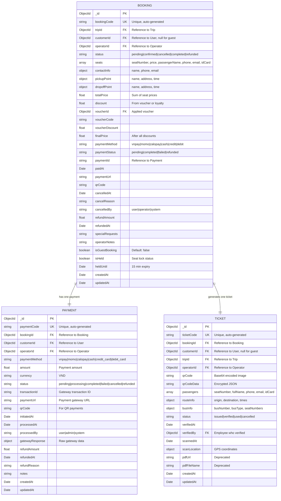
```mermaid
erDiagram
    BOOKING {
        ObjectId _id PK
        string bookingCode UK "Unique, auto-generated"
        ObjectId tripId FK "Reference to Trip"
        ObjectId customerId FK "Reference to User, null for guest"
        ObjectId operatorId FK "Reference to Operator"
        string status "pending|confirmed|cancelled|completed|refunded"
        array seats "seatNumber, price, passengerName, phone, email, idCard"
        object contactInfo "name, phone, email"
        object pickupPoint "name, address, time"
        object dropoffPoint "name, address, time"
        float totalPrice "Sum of seat prices"
        float discount "From voucher or loyalty"
        ObjectId voucherId FK "Applied voucher"
        string voucherCode
        float voucherDiscount
        float finalPrice "After all discounts"
        string paymentMethod "vnpay|momo|zalopay|cash|credit|debit"
        string paymentStatus "pending|completed|failed|refunded"
        string paymentId "Reference to Payment"
        Date paidAt
        string paymentUrl
        string qrCode
        Date cancelledAt
        string cancelReason
        string cancelledBy "user|operator|system"
        float refundAmount
        Date refundedAt
        string specialRequests
        string operatorNotes
        boolean isGuestBooking "Default: false"
        boolean isHeld "Seat lock status"
        Date heldUntil "15 min expiry"
        Date createdAt
        Date updatedAt
    }

    PAYMENT {
        ObjectId _id PK
        string paymentCode UK "Unique, auto-generated"
        ObjectId bookingId FK "Reference to Booking"
        ObjectId customerId FK "Reference to User"
        ObjectId operatorId FK "Reference to Operator"
        string paymentMethod "vnpay|momo|zalopay|cash|credit_card|debit_card"
        float amount "Payment amount"
        string currency "VND"
        string status "pending|processing|completed|failed|cancelled|refunded"
        string transactionId "Gateway transaction ID"
        string paymentUrl "Payment gateway URL"
        string qrCode "For QR payments"
        Date initiatedAt
        Date processedAt
        string processedBy "user|admin|system"
        object gatewayResponse "Raw gateway data"
        float refundAmount
        Date refundedAt
        string refundReason
        string notes
        Date createdAt
        Date updatedAt
    }

    TICKET {
        ObjectId _id PK
        string ticketCode UK "Unique, auto-generated"
        ObjectId bookingId FK "Reference to Booking"
        ObjectId customerId FK "Reference to User, null for guest"
        ObjectId tripId FK "Reference to Trip"
        ObjectId operatorId FK "Reference to Operator"
        string qrCode "Base64 encoded image"
        string qrCodeData "Encrypted JSON"
        array passengers "seatNumber, fullName, phone, email, idCard"
        object routeInfo "origin, destination, times"
        object busInfo "busNumber, busType, seatNumbers"
        string status "issued|verified|used|cancelled"
        Date verifiedAt
        ObjectId verifiedBy FK "Employee who verified"
        Date scannedAt
        object scanLocation "GPS coordinates"
        string pdfUrl "Deprecated"
        string pdfFileName "Deprecated"
        Date createdAt
        Date updatedAt
    }

    BOOKING ||--|| PAYMENT : "has one payment"
    BOOKING ||--|| TICKET : "generates one ticket"
```

### 5.5. Reviews & Vouchers - Chi Tiết

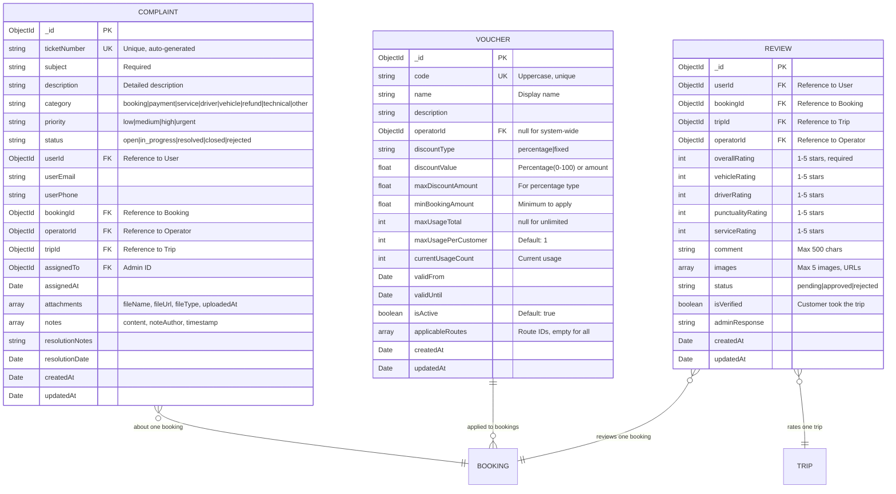
```mermaid
erDiagram
    REVIEW {
        ObjectId _id PK
        ObjectId userId FK "Reference to User"
        ObjectId bookingId FK "Reference to Booking"
        ObjectId tripId FK "Reference to Trip"
        ObjectId operatorId FK "Reference to Operator"
        int overallRating "1-5 stars, required"
        int vehicleRating "1-5 stars"
        int driverRating "1-5 stars"
        int punctualityRating "1-5 stars"
        int serviceRating "1-5 stars"
        string comment "Max 500 chars"
        array images "Max 5 images, URLs"
        string status "pending|approved|rejected"
        boolean isVerified "Customer took the trip"
        string adminResponse
        Date createdAt
        Date updatedAt
    }

    VOUCHER {
        ObjectId _id PK
        string code UK "Uppercase, unique"
        string name "Display name"
        string description
        ObjectId operatorId FK "null for system-wide"
        string discountType "percentage|fixed"
        float discountValue "Percentage(0-100) or amount"
        float maxDiscountAmount "For percentage type"
        float minBookingAmount "Minimum to apply"
        int maxUsageTotal "null for unlimited"
        int maxUsagePerCustomer "Default: 1"
        int currentUsageCount "Current usage"
        Date validFrom
        Date validUntil
        boolean isActive "Default: true"
        array applicableRoutes "Route IDs, empty for all"
        Date createdAt
        Date updatedAt
    }

    COMPLAINT {
        ObjectId _id PK
        string ticketNumber UK "Unique, auto-generated"
        string subject "Required"
        string description "Detailed description"
        string category "booking|payment|service|driver|vehicle|refund|technical|other"
        string priority "low|medium|high|urgent"
        string status "open|in_progress|resolved|closed|rejected"
        ObjectId userId FK "Reference to User"
        string userEmail
        string userPhone
        ObjectId bookingId FK "Reference to Booking"
        ObjectId operatorId FK "Reference to Operator"
        ObjectId tripId FK "Reference to Trip"
        ObjectId assignedTo FK "Admin ID"
        Date assignedAt
        array attachments "fileName, fileUrl, fileType, uploadedAt"
        array notes "content, noteAuthor, timestamp"
        string resolutionNotes
        Date resolutionDate
        Date createdAt
        Date updatedAt
    }

    REVIEW }o--|| BOOKING : "reviews one booking"
    REVIEW }o--|| TRIP : "rates one trip"
    VOUCHER ||--o{ BOOKING : "applied to bookings"
    COMPLAINT }o--|| BOOKING : "about one booking"
```

### 5.6. Content Management - Chi Tiết

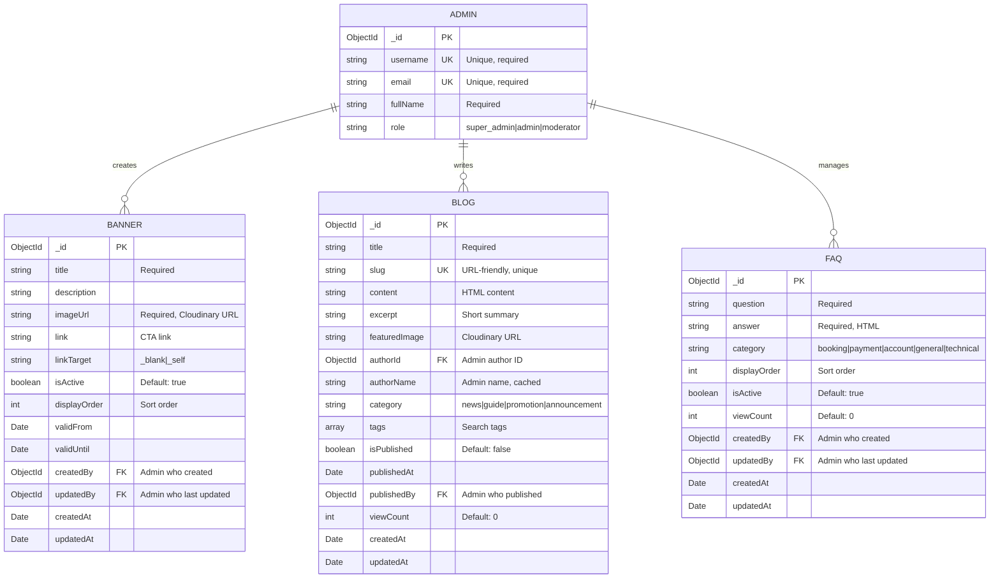
```mermaid
erDiagram
    ADMIN ||--o{ BANNER : creates
    ADMIN ||--o{ BLOG : writes
    ADMIN ||--o{ FAQ : manages

    ADMIN {
        ObjectId _id PK
        string username UK "Unique, required"
        string email UK "Unique, required"
        string fullName "Required"
        string role "super_admin|admin|moderator"
    }

    BANNER {
        ObjectId _id PK
        string title "Required"
        string description
        string imageUrl "Required, Cloudinary URL"
        string link "CTA link"
        string linkTarget "_blank|_self"
        boolean isActive "Default: true"
        int displayOrder "Sort order"
        Date validFrom
        Date validUntil
        ObjectId createdBy FK "Admin who created"
        ObjectId updatedBy FK "Admin who last updated"
        Date createdAt
        Date updatedAt
    }

    BLOG {
        ObjectId _id PK
        string title "Required"
        string slug UK "URL-friendly, unique"
        string content "HTML content"
        string excerpt "Short summary"
        string featuredImage "Cloudinary URL"
        ObjectId authorId FK "Admin author ID"
        string authorName "Admin name, cached"
        string category "news|guide|promotion|announcement"
        array tags "Search tags"
        boolean isPublished "Default: false"
        Date publishedAt
        ObjectId publishedBy FK "Admin who published"
        int viewCount "Default: 0"
        Date createdAt
        Date updatedAt
    }

    FAQ {
        ObjectId _id PK
        string question "Required"
        string answer "Required, HTML"
        string category "booking|payment|account|general|technical"
        int displayOrder "Sort order"
        boolean isActive "Default: true"
        int viewCount "Default: 0"
        ObjectId createdBy FK "Admin who created"
        ObjectId updatedBy FK "Admin who last updated"
        Date createdAt
        Date updatedAt
    }
```

### 5.7. Indexes và Constraints

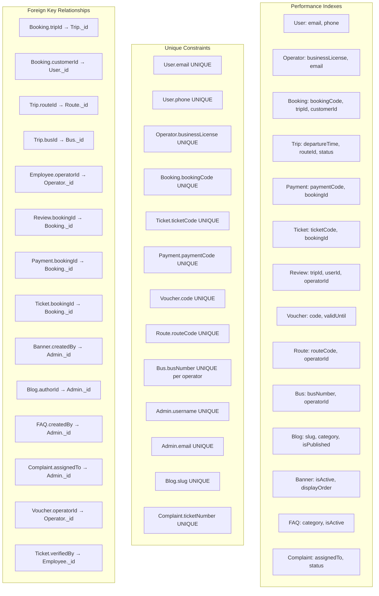
```mermaid
graph TD
    subgraph "Performance Indexes"
        IDX1[User: email, phone]
        IDX2[Operator: businessLicense, email]
        IDX3[Booking: bookingCode, tripId, customerId]
        IDX4[Trip: departureTime, routeId, status]
        IDX5[Payment: paymentCode, bookingId]
        IDX6[Ticket: ticketCode, bookingId]
        IDX7[Review: tripId, userId, operatorId]
        IDX8[Voucher: code, validUntil]
        IDX9[Route: routeCode, operatorId]
        IDX10[Bus: busNumber, operatorId]
        IDX11[Blog: slug, category, isPublished]
        IDX12[Banner: isActive, displayOrder]
        IDX13[FAQ: category, isActive]
        IDX14[Complaint: assignedTo, status]
    end

    subgraph "Unique Constraints"
        UK1[User.email UNIQUE]
        UK2[User.phone UNIQUE]
        UK3[Operator.businessLicense UNIQUE]
        UK4[Booking.bookingCode UNIQUE]
        UK5[Ticket.ticketCode UNIQUE]
        UK6[Payment.paymentCode UNIQUE]
        UK7[Voucher.code UNIQUE]
        UK8[Route.routeCode UNIQUE]
        UK9[Bus.busNumber UNIQUE per operator]
        UK10[Admin.username UNIQUE]
        UK11[Admin.email UNIQUE]
        UK12[Blog.slug UNIQUE]
        UK13[Complaint.ticketNumber UNIQUE]
    end

    subgraph "Foreign Key Relationships"
        FK1[Booking.tripId → Trip._id]
        FK2[Booking.customerId → User._id]
        FK3[Trip.routeId → Route._id]
        FK4[Trip.busId → Bus._id]
        FK5[Employee.operatorId → Operator._id]
        FK6[Review.bookingId → Booking._id]
        FK7[Payment.bookingId → Booking._id]
        FK8[Ticket.bookingId → Booking._id]
        FK9[Banner.createdBy → Admin._id]
        FK10[Blog.authorId → Admin._id]
        FK11[FAQ.createdBy → Admin._id]
        FK12[Complaint.assignedTo → Admin._id]
        FK13[Voucher.operatorId → Operator._id]
        FK14[Ticket.verifiedBy → Employee._id]
    end
```

## 6. Luồng Thanh Toán

```mermaid
flowchart TD
    START([Khách hàng xác nhận đặt vé]) --> SELECT{Chọn phương thức thanh toán}

    SELECT -->|VNPay| VNPAY[Tạo payment URL VNPay]
    SELECT -->|Momo| MOMO[Tạo QR Momo]
    SELECT -->|ZaloPay| ZALO[Tạo QR ZaloPay]
    SELECT -->|Thẻ tín dụng| CARD[Payment gateway thẻ]
    SELECT -->|Tiền mặt| CASH[Giữ chỗ - Thanh toán sau]

    VNPAY --> REDIRECT[Redirect đến VNPay]
    MOMO --> QRCODE[Hiển thị QR code]
    ZALO --> QRCODE
    CARD --> CARDFORM[Form nhập thẻ]

    REDIRECT --> CUSTOMER_PAY{Khách thanh toán}
    QRCODE --> CUSTOMER_PAY
    CARDFORM --> CUSTOMER_PAY

    CUSTOMER_PAY -->|Thành công| WEBHOOK[Webhook callback]
    CUSTOMER_PAY -->|Thất bại| FAILED
    CUSTOMER_PAY -->|Timeout| FAILED

    WEBHOOK --> UPDATE_PAYMENT[Update payment status: completed]
    UPDATE_PAYMENT --> UPDATE_BOOKING[Update booking status: confirmed]
    UPDATE_BOOKING --> GEN_TICKET[Generate ticket + QR code]
    GEN_TICKET --> SEND_EMAIL[Gửi email ticket]
    SEND_EMAIL --> ADD_POINTS[Cộng điểm loyalty]
    ADD_POINTS --> SUCCESS([Đặt vé thành công])

    CASH --> HOLD[Hold booking 24h]
    HOLD --> MANUAL_CONFIRM{Admin xác nhận thanh toán}
    MANUAL_CONFIRM -->|Đã thanh toán| UPDATE_BOOKING
    MANUAL_CONFIRM -->|Không thanh toán| TIMEOUT

    FAILED[Payment failed] --> RELEASE_SEATS[Giải phóng ghế]
    TIMEOUT[Timeout] --> RELEASE_SEATS
    RELEASE_SEATS --> CANCEL_BOOKING[Cancel booking]
    CANCEL_BOOKING --> END([Đặt vé thất bại])
```

## 7. Hệ Thống Loyalty Points

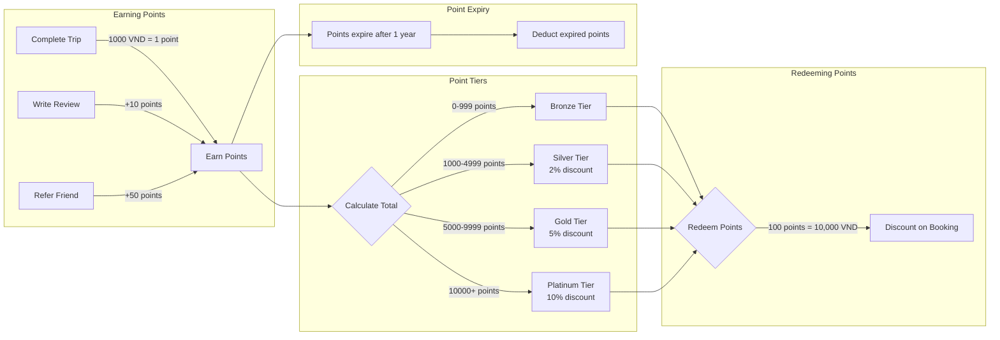
```mermaid
graph LR
    subgraph "Earning Points"
        BOOK[Complete Trip] -->|1000 VND = 1 point| EARN[Earn Points]
        REVIEW[Write Review] -->|+10 points| EARN
        REFERRAL[Refer Friend] -->|+50 points| EARN
    end

    subgraph "Point Tiers"
        EARN --> CALC{Calculate Total}
        CALC -->|0-999 points| BRONZE[Bronze Tier]
        CALC -->|1000-4999 points| SILVER[Silver Tier<br/>2% discount]
        CALC -->|5000-9999 points| GOLD[Gold Tier<br/>5% discount]
        CALC -->|10000+ points| PLATINUM[Platinum Tier<br/>10% discount]
    end

    subgraph "Redeeming Points"
        BRONZE --> REDEEM{Redeem Points}
        SILVER --> REDEEM
        GOLD --> REDEEM
        PLATINUM --> REDEEM

        REDEEM -->|100 points = 10,000 VND| DISCOUNT[Discount on Booking]
    end

    subgraph "Point Expiry"
        EARN --> EXPIRY[Points expire after 1 year]
        EXPIRY --> DEDUCT[Deduct expired points]
    end
```

## 8. Quy Trình Xác Minh Vé (QR Code)

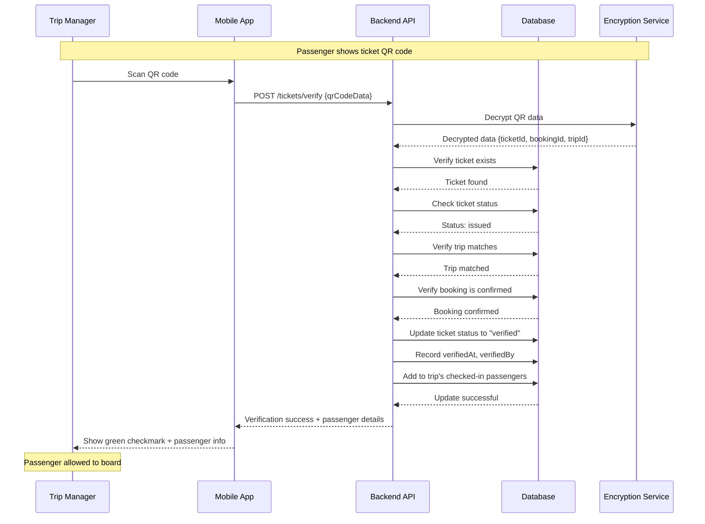
```mermaid
sequenceDiagram
    participant TM as Trip Manager
    participant APP as Mobile App
    participant API as Backend API
    participant DB as Database
    participant CRYPT as Encryption Service

    Note over TM,CRYPT: Passenger shows ticket QR code

    TM->>APP: Scan QR code
    APP->>API: POST /tickets/verify {qrCodeData}

    API->>CRYPT: Decrypt QR data
    CRYPT-->>API: Decrypted data {ticketId, bookingId, tripId}

    API->>DB: Verify ticket exists
    DB-->>API: Ticket found

    API->>DB: Check ticket status
    DB-->>API: Status: issued

    API->>DB: Verify trip matches
    DB-->>API: Trip matched

    API->>DB: Verify booking is confirmed
    DB-->>API: Booking confirmed

    API->>DB: Update ticket status to "verified"
    API->>DB: Record verifiedAt, verifiedBy
    API->>DB: Add to trip's checked-in passengers

    DB-->>API: Update successful

    API-->>APP: Verification success + passenger details
    APP-->>TM: Show green checkmark + passenger info

    Note over TM: Passenger allowed to board
```

## 9. Workflow Operator

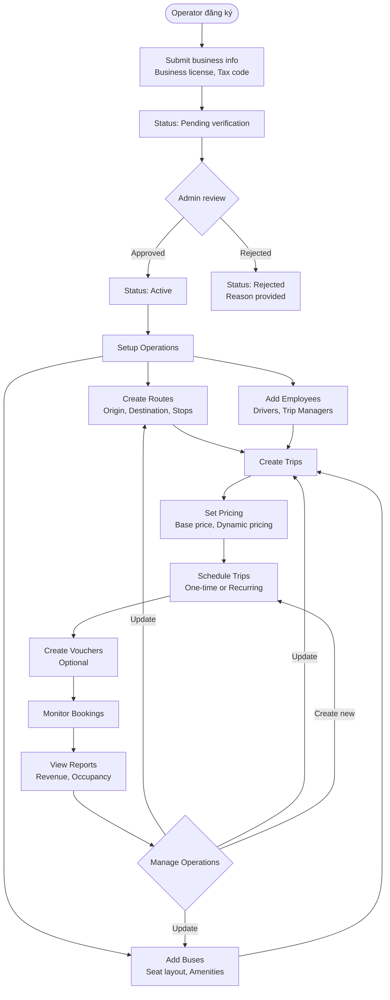
```mermaid
flowchart TD
    START([Operator đăng ký]) --> SUBMIT[Submit business info<br/>Business license, Tax code]
    SUBMIT --> PENDING[Status: Pending verification]

    PENDING --> ADMIN_REVIEW{Admin review}
    ADMIN_REVIEW -->|Approved| ACTIVE[Status: Active]
    ADMIN_REVIEW -->|Rejected| REJECTED[Status: Rejected<br/>Reason provided]

    ACTIVE --> SETUP[Setup Operations]

    SETUP --> ROUTE[Create Routes<br/>Origin, Destination, Stops]
    SETUP --> BUS[Add Buses<br/>Seat layout, Amenities]
    SETUP --> EMP[Add Employees<br/>Drivers, Trip Managers]

    ROUTE --> TRIP[Create Trips]
    BUS --> TRIP
    EMP --> TRIP

    TRIP --> PRICING[Set Pricing<br/>Base price, Dynamic pricing]
    PRICING --> SCHEDULE[Schedule Trips<br/>One-time or Recurring]

    SCHEDULE --> VOUCHER[Create Vouchers<br/>Optional]
    VOUCHER --> MONITOR[Monitor Bookings]

    MONITOR --> REPORTS[View Reports<br/>Revenue, Occupancy]
    REPORTS --> MANAGE{Manage Operations}

    MANAGE -->|Update| ROUTE
    MANAGE -->|Update| BUS
    MANAGE -->|Update| TRIP
    MANAGE -->|Create new| SCHEDULE
```

## 10. Complaint Resolution Flow

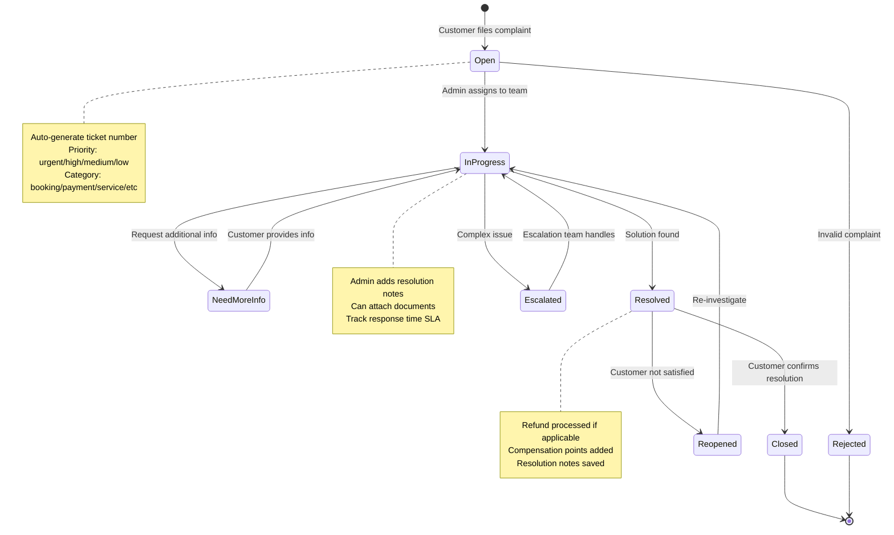
```mermaid
stateDiagram-v2
    [*] --> Open: Customer files complaint

    Open --> InProgress: Admin assigns to team
    InProgress --> NeedMoreInfo: Request additional info
    NeedMoreInfo --> InProgress: Customer provides info

    InProgress --> Resolved: Solution found
    InProgress --> Escalated: Complex issue

    Escalated --> InProgress: Escalation team handles

    Resolved --> Closed: Customer confirms resolution
    Resolved --> Reopened: Customer not satisfied

    Reopened --> InProgress: Re-investigate

    Open --> Rejected: Invalid complaint

    Closed --> [*]
    Rejected --> [*]

    note right of Open
        Auto-generate ticket number
        Priority: urgent/high/medium/low
        Category: booking/payment/service/etc
    end note

    note right of InProgress
        Admin adds resolution notes
        Can attach documents
        Track response time SLA
    end note

    note right of Resolved
        Refund processed if applicable
        Compensation points added
        Resolution notes saved
    end note
```

## 11. Real-time Updates với Socket.IO

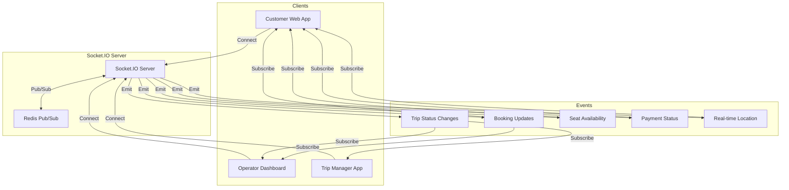
```mermaid
graph TB
    subgraph "Clients"
        CUSTOMER[Customer Web App]
        OPERATOR[Operator Dashboard]
        TRIPMGR[Trip Manager App]
    end

    subgraph "Socket.IO Server"
        SOCKET[Socket.IO Server]
        REDIS[Redis Pub/Sub]
    end

    subgraph "Events"
        BOOK_UPDATE[Booking Updates]
        TRIP_STATUS[Trip Status Changes]
        SEAT_AVAIL[Seat Availability]
        PAYMENT_STATUS[Payment Status]
        LOCATION[Real-time Location]
    end

    CUSTOMER -->|Connect| SOCKET
    OPERATOR -->|Connect| SOCKET
    TRIPMGR -->|Connect| SOCKET

    SOCKET <-->|Pub/Sub| REDIS

    SOCKET -->|Emit| BOOK_UPDATE
    SOCKET -->|Emit| TRIP_STATUS
    SOCKET -->|Emit| SEAT_AVAIL
    SOCKET -->|Emit| PAYMENT_STATUS
    SOCKET -->|Emit| LOCATION

    BOOK_UPDATE -->|Subscribe| CUSTOMER
    SEAT_AVAIL -->|Subscribe| CUSTOMER
    PAYMENT_STATUS -->|Subscribe| CUSTOMER

    BOOK_UPDATE -->|Subscribe| OPERATOR
    TRIP_STATUS -->|Subscribe| OPERATOR

    LOCATION -->|Subscribe| CUSTOMER
    TRIP_STATUS -->|Subscribe| TRIPMGR
```

## 12. Seat Locking Mechanism

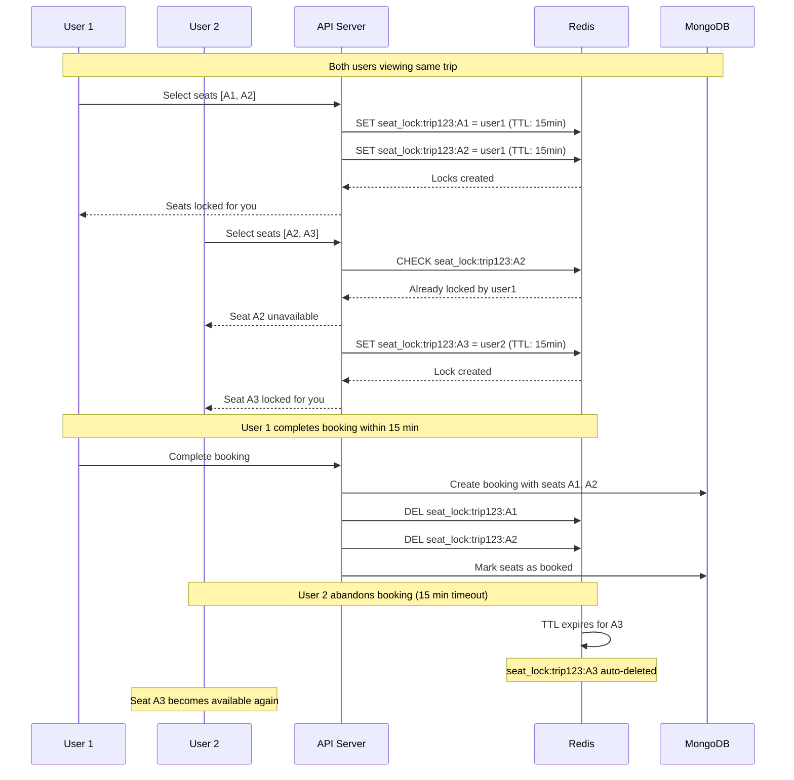
```mermaid
sequenceDiagram
    participant U1 as User 1
    participant U2 as User 2
    participant API as API Server
    participant REDIS as Redis
    participant DB as MongoDB

    Note over U1,DB: Both users viewing same trip

    U1->>API: Select seats [A1, A2]
    API->>REDIS: SET seat_lock:trip123:A1 = user1 (TTL: 15min)
    API->>REDIS: SET seat_lock:trip123:A2 = user1 (TTL: 15min)
    REDIS-->>API: Locks created
    API-->>U1: Seats locked for you

    U2->>API: Select seats [A2, A3]
    API->>REDIS: CHECK seat_lock:trip123:A2
    REDIS-->>API: Already locked by user1
    API-->>U2: Seat A2 unavailable

    API->>REDIS: SET seat_lock:trip123:A3 = user2 (TTL: 15min)
    REDIS-->>API: Lock created
    API-->>U2: Seat A3 locked for you

    Note over U1,REDIS: User 1 completes booking within 15 min

    U1->>API: Complete booking
    API->>DB: Create booking with seats A1, A2
    API->>REDIS: DEL seat_lock:trip123:A1
    API->>REDIS: DEL seat_lock:trip123:A2
    API->>DB: Mark seats as booked

    Note over U2,REDIS: User 2 abandons booking (15 min timeout)

    REDIS->>REDIS: TTL expires for A3
    Note over REDIS: seat_lock:trip123:A3 auto-deleted

    Note over U2: Seat A3 becomes available again
```

---

## Tổng Kết Kiến Trúc

### Technology Stack Diagram

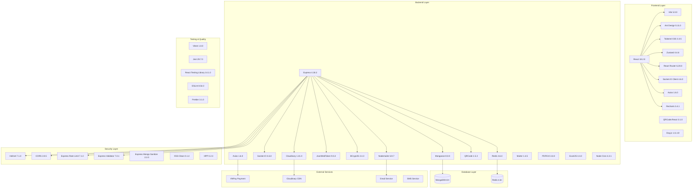
```mermaid
graph TB
    subgraph "Frontend Layer"
        REACT[React 18.2.0]
        VITE[Vite 5.0.0]
        ANTD[Ant Design 5.11.0]
        TAILWIND[Tailwind CSS 3.3.5]
        ZUSTAND[Zustand 4.4.6]
        RRD[React Router 6.20.0]
        SOCKETCLIENT[Socket.IO Client 4.6.0]
        AXIOS_FE[Axios 1.6.0]
        RECHARTS[Recharts 3.4.1]
        QRREACT[QRCode.React 3.1.0]
        DAYJS[Day.js 1.11.10]
    end

    subgraph "Backend Layer"
        EXPRESS[Express 4.18.2]
        MONGOOSE[Mongoose 8.0.0]
        SOCKETIO[Socket.IO 4.6.0]
        REDIS_LIB[Redis 4.6.0]
        JWT[JsonWebToken 9.0.2]
        BCRYPT[BCryptJS 2.4.3]
        AXIOS_BE[Axios 1.6.0]
        NODEMAILER[Nodemailer 6.9.7]
        QRCODE[QRCode 1.5.3]
        CLOUDINARY_LIB[Cloudinary 1.41.0]
        MULTER[Multer 1.4.5]
        PDFKIT[PDFKit 0.13.0]
        EXCELJS[ExcelJS 4.4.0]
        CRON[Node-Cron 4.2.1]
    end

    subgraph "Security Layer"
        HELMET[Helmet 7.1.0]
        CORS[CORS 2.8.5]
        RATELIMIT[Express Rate Limit 7.1.0]
        VALIDATOR[Express Validator 7.0.1]
        SANITIZE[Express Mongo Sanitize 2.2.0]
        XSS[XSS-Clean 0.1.4]
        HPP[HPP 0.2.3]
    end

    subgraph "Database Layer"
        MONGODB[(MongoDB 8.0+)]
        REDIS_DB[(Redis 4.6+)]
    end

    subgraph "External Services"
        VNPAY_SVC[VNPay Payment]
        CLOUDINARY_SVC[Cloudinary CDN]
        EMAIL_SVC[Email Service]
        SMS_SVC[SMS Service]
    end

    subgraph "Testing & Quality"
        VITEST[Vitest 1.0.0]
        JEST[Jest 29.7.0]
        RTL[React Testing Library 14.1.0]
        ESLINT[ESLint 8.54.0]
        PRETTIER[Prettier 3.1.0]
    end

    REACT --> VITE
    REACT --> ANTD
    REACT --> TAILWIND
    REACT --> ZUSTAND
    REACT --> RRD
    REACT --> SOCKETCLIENT
    REACT --> AXIOS_FE
    REACT --> RECHARTS

    EXPRESS --> MONGOOSE
    EXPRESS --> SOCKETIO
    EXPRESS --> REDIS_LIB
    EXPRESS --> JWT
    EXPRESS --> BCRYPT

    EXPRESS --> HELMET
    EXPRESS --> CORS
    EXPRESS --> RATELIMIT
    EXPRESS --> VALIDATOR

    MONGOOSE --> MONGODB
    REDIS_LIB --> REDIS_DB

    EXPRESS --> CLOUDINARY_LIB
    EXPRESS --> NODEMAILER
    EXPRESS --> QRCODE

    CLOUDINARY_LIB --> CLOUDINARY_SVC
    NODEMAILER --> EMAIL_SVC
    AXIOS_BE --> VNPAY_SVC
```

### Chi Tiết Công Nghệ Sử Dụng

#### Frontend Dependencies

| Package | Version | Mục đích sử dụng |
|---------|---------|------------------|
| **react** | 18.2.0 | Core UI library |
| **react-dom** | 18.2.0 | DOM rendering |
| **vite** | 5.0.0 | Build tool & dev server |
| **react-router-dom** | 6.20.0 | Client-side routing |
| **antd** | 5.11.0 | UI component library |
| **@ant-design/icons** | 5.2.6 | Icon library |
| **tailwindcss** | 3.3.5 | Utility-first CSS framework |
| **zustand** | 4.4.6 | State management (với persistence) |
| **axios** | 1.6.0 | HTTP client |
| **socket.io-client** | 4.6.0 | Real-time communication |
| **recharts** | 3.4.1 | Charts & data visualization |
| **qrcode.react** | 3.1.0 | QR code generation |
| **html5-qrcode** | 2.3.8 | QR code scanning |
| **react-qr-scanner** | 1.0.0-alpha.11 | QR scanner component |
| **dayjs** | 1.11.10 | Date manipulation |
| **react-hot-toast** | 2.4.1 | Toast notifications |
| **lucide-react** | 0.555.0 | Icon library |
| **react-icons** | 5.5.0 | Icon library |

#### Backend Dependencies

| Package | Version | Mục đích sử dụng |
|---------|---------|------------------|
| **express** | 4.18.2 | Web framework |
| **mongoose** | 8.0.0 | MongoDB ODM |
| **redis** | 4.6.0 | Redis client (caching, pub/sub) |
| **socket.io** | 4.6.0 | Real-time WebSocket server |
| **jsonwebtoken** | 9.0.2 | JWT authentication |
| **bcryptjs** | 2.4.3 | Password hashing |
| **dotenv** | 16.3.1 | Environment variables |
| **axios** | 1.6.0 | HTTP client (payment gateways) |
| **cors** | 2.8.5 | Cross-Origin Resource Sharing |
| **helmet** | 7.1.0 | Security headers |
| **express-rate-limit** | 7.1.0 | Rate limiting |
| **express-validator** | 7.0.1 | Request validation |
| **express-mongo-sanitize** | 2.2.0 | MongoDB injection prevention |
| **xss-clean** | 0.1.4 | XSS attack prevention |
| **hpp** | 0.2.3 | HTTP parameter pollution |
| **morgan** | 1.10.0 | HTTP request logger |
| **compression** | 1.7.4 | Response compression |
| **cookie-parser** | 1.4.6 | Cookie parsing |
| **nodemailer** | 6.9.7 | Email sending |
| **cloudinary** | 1.41.0 | Image/file storage |
| **multer** | 1.4.5-lts.1 | File upload handling |
| **qrcode** | 1.5.3 | QR code generation |
| **pdfkit** | 0.13.0 | PDF generation |
| **exceljs** | 4.4.0 | Excel file generation |
| **moment** | 2.30.1 | Date/time manipulation |
| **moment-timezone** | 0.5.43 | Timezone handling |
| **node-cron** | 4.2.1 | Scheduled tasks |
| **uuid** | 8.3.2 | UUID generation |

#### Development & Testing Tools

| Package | Version | Mục đích sử dụng |
|---------|---------|------------------|
| **Frontend Testing** |
| **vitest** | 1.0.0 | Unit testing framework |
| **@vitest/ui** | 1.0.0 | Test UI |
| **@vitest/coverage-v8** | 1.6.1 | Code coverage |
| **@testing-library/react** | 14.1.0 | React testing utilities |
| **@testing-library/jest-dom** | 6.1.4 | DOM matchers |
| **@testing-library/user-event** | 14.5.1 | User interaction simulation |
| **jsdom** | 27.2.0 | DOM implementation for testing |
| **Backend Testing** |
| **jest** | 29.7.0 | Testing framework |
| **supertest** | 6.3.3 | HTTP assertion library |
| **Code Quality** |
| **eslint** | 8.54.0 | JavaScript linter |
| **eslint-config-airbnb** | 19.0.4 / 15.0.0 | Airbnb style guide |
| **eslint-config-prettier** | 9.1.0 | Prettier integration |
| **eslint-plugin-security** | 1.7.1 | Security linting |
| **prettier** | 3.1.0 | Code formatter |
| **autoprefixer** | 10.4.16 | CSS autoprefixer |
| **postcss** | 8.4.31 | CSS processor |
| **Dev Tools** |
| **nodemon** | 3.0.1 | Auto-restart on file changes |
| **concurrently** | 8.2.2 | Run multiple commands |

### Architecture Layers

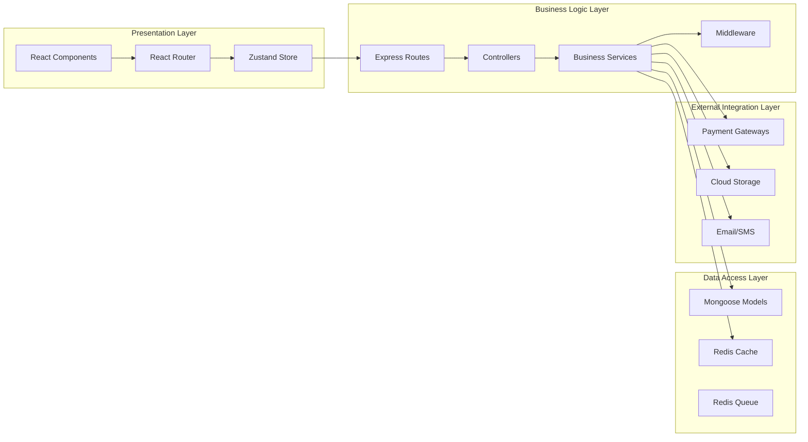
```mermaid
graph LR
    subgraph "Presentation Layer"
        UI[React Components]
        ROUTING[React Router]
        STATE[Zustand Store]
    end

    subgraph "Business Logic Layer"
        API_ROUTES[Express Routes]
        CONTROLLERS[Controllers]
        SERVICES[Business Services]
        MIDDLEWARE[Middleware]
    end

    subgraph "Data Access Layer"
        MODELS[Mongoose Models]
        CACHE[Redis Cache]
        QUEUE[Redis Queue]
    end

    subgraph "External Integration Layer"
        PAYMENT[Payment Gateways]
        STORAGE[Cloud Storage]
        MESSAGING[Email/SMS]
    end

    UI --> ROUTING
    ROUTING --> STATE
    STATE --> API_ROUTES
    API_ROUTES --> CONTROLLERS
    CONTROLLERS --> SERVICES
    SERVICES --> MIDDLEWARE
    SERVICES --> MODELS
    SERVICES --> CACHE
    SERVICES --> PAYMENT
    SERVICES --> STORAGE
    SERVICES --> MESSAGING
```

### Security Implementation

```mermaid
graph TD
    REQUEST[Incoming Request] --> HELMET[Helmet: Security Headers]
    HELMET --> CORS[CORS: Origin Validation]
    CORS --> RATELIMIT[Rate Limiting]
    RATELIMIT --> HPP[HPP: Parameter Pollution]
    HPP --> SANITIZE[Mongo Sanitize: NoSQL Injection]
    SANITIZE --> XSS[XSS Clean: Cross-Site Scripting]
    XSS --> VALIDATOR[Express Validator: Input Validation]
    VALIDATOR --> JWT[JWT: Authentication]
    JWT --> AUTH[Authorization Check]
    AUTH --> CONTROLLER[Controller Handler]

    CONTROLLER --> ENCRYPT[BCrypt: Password Hashing]
    CONTROLLER --> COMPRESSION[Compression: Response Size]
    COMPRESSION --> RESPONSE[Response to Client]
```

### Data Flow Architecture

```mermaid
sequenceDiagram
    participant Client
    participant Vite as Vite Dev Server
    participant React as React App
    participant Zustand as State Store
    participant Axios
    participant Express as Express API
    participant Service as Business Service
    participant Redis
    participant Mongoose
    participant MongoDB

    Client->>Vite: HTTP Request
    Vite->>React: Serve React App
    React->>Zustand: Get/Update State
    React->>Axios: API Call
    Axios->>Express: HTTP Request
    Express->>Service: Process Request

    alt Cache Available
        Service->>Redis: Check Cache
        Redis-->>Service: Return Cached Data
    else Cache Miss
        Service->>Mongoose: Query Database
        Mongoose->>MongoDB: Execute Query
        MongoDB-->>Mongoose: Return Data
        Mongoose-->>Service: Return Models
        Service->>Redis: Update Cache
    end

    Service-->>Express: Return Response
    Express-->>Axios: JSON Response
    Axios-->>Zustand: Update State
    Zustand-->>React: Re-render UI
    React-->>Client: Updated View
```

### Performance Optimization

| Kỹ thuật | Công nghệ | Mô tả |
|----------|-----------|-------|
| **Caching** | Redis | Cache query results, session data, seat locks |
| **Compression** | Express Compression | Gzip response compression |
| **Code Splitting** | Vite + React.lazy | Dynamic imports, route-based splitting |
| **Image Optimization** | Cloudinary | CDN, automatic format conversion, resizing |
| **Database Indexing** | MongoDB | Compound indexes on frequent queries |
| **Connection Pooling** | Mongoose | Reuse database connections |
| **Rate Limiting** | Express Rate Limit | Prevent API abuse |
| **Lazy Loading** | React Suspense | Load components on demand |
| **Memoization** | React.memo | Prevent unnecessary re-renders |
| **WebSocket** | Socket.IO | Real-time updates without polling |

### Deployment Requirements

| Component | Requirement | Notes |
|-----------|-------------|-------|
| **Runtime** | Node.js ≥18.0.0 | ES2022 features required |
| **Package Manager** | npm ≥9.0.0 | Workspace support |
| **Database** | MongoDB ≥6.0 | Time series collections |
| **Cache** | Redis ≥4.6 | Pub/Sub support |
| **Memory** | 2GB+ RAM | For backend processes |
| **Storage** | 20GB+ | Logs, uploads, backups |
| **Network** | HTTPS/WSS | SSL/TLS certificates |
| **Ports** | 3000 (Frontend), 5000 (Backend) | Configurable via ENV |

### Environment Variables Structure

```mermaid
graph LR
    subgraph "Backend ENV"
        PORT[PORT=5000]
        NODE_ENV[NODE_ENV=production]
        MONGO[MONGODB_URI]
        REDIS_URL[REDIS_URL]
        JWT_SECRET[JWT_SECRET]
        CLOUDINARY[CLOUDINARY_*]
        VNPAY[VNPAY_*]
        EMAIL[EMAIL_*]
    end

    subgraph "Frontend ENV"
        VITE_API[VITE_API_URL]
        VITE_WS[VITE_WS_URL]
    end
```

### Đặc Điểm Nổi Bật

1. **Multi-tenant System**: Hỗ trợ nhiều nhà xe độc lập
2. **Real-time Updates**: Socket.IO cho thông tin chuyến xe và ghế trống
3. **Dynamic Pricing**: Giá linh hoạt theo nhu cầu, giờ cao điểm, cuối tuần
4. **Loyalty Program**: 4 tier với điểm thưởng tự động
5. **Seat Locking**: Redis-based locking mechanism (15 phút)
6. **QR Code Verification**: Mã hóa QR code để bảo mật
7. **Guest Booking**: Không bắt buộc tài khoản
8. **Recurring Trips**: Tạo chuyến xe định kỳ tự động
9. **Multi-payment**: 6 phương thức thanh toán (VNPay, Momo, ZaloPay, Credit Card, Debit Card, Cash)
10. **Responsive Design**: Mobile-first approach
11. **Comprehensive Security**: Helmet, CORS, Rate Limiting, Input Validation, XSS Protection
12. **Automated Tasks**: Node-Cron cho point expiry, booking cleanup, report generation
13. **File Export**: Excel & PDF generation cho reports và tickets
14. **Image Processing**: Cloudinary CDN với automatic optimization
15. **Email Notifications**: Automated emails cho booking confirmations, cancellations, reminders

