# Sơ Đồ Hệ Thống QuikRide Bus Booking

## 1. Kiến Trúc Tổng Quan

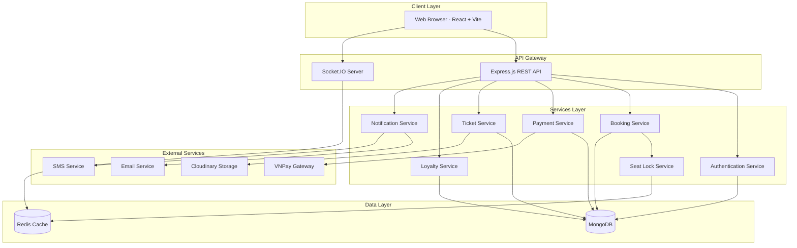

## 2. Phân Quyền Người Dùng

```mermaid
graph TD
    USERS[Users] --> CUSTOMER[Customer/Guest]
    USERS --> OPERATOR[Bus Operator]
    USERS --> TRIPMGR[Trip Manager]
    USERS --> ADMIN[Admin]

    CUSTOMER --> |Search & Book| SEARCH[Search Trips]
    CUSTOMER --> |Manage| MYTICKETS[My Tickets]
    CUSTOMER --> |Earn| LOYALTY[Loyalty Points]
    CUSTOMER --> |Review| REVIEW[Review & Rating]
    CUSTOMER --> |Report| COMPLAINT[Complaints]

    OPERATOR --> |Manage| ROUTES[Routes Management]
    OPERATOR --> |Manage| BUSES[Buses Management]
    OPERATOR --> |Schedule| TRIPS[Trips Scheduling]
    OPERATOR --> |Manage| EMPLOYEES[Employee Management]
    OPERATOR --> |Create| VOUCHERS[Vouchers]
    OPERATOR --> |View| REPORTS[Revenue Reports]

    TRIPMGR --> |View| DASHBOARD[Active Trips Dashboard]
    TRIPMGR --> |Scan| QRSCANNER[QR Code Scanner]
    TRIPMGR --> |Update| STATUS[Journey Status]
    TRIPMGR --> |Track| PASSENGERS[Passenger List]

    ADMIN --> |Verify| OPERATORS[Operator Verification]
    ADMIN --> |Manage| ALLUSERS[User Management]
    ADMIN --> |Handle| COMPLAINTS[Complaint Resolution]
    ADMIN --> |Manage| CONTENT[Content Management]
    ADMIN --> |View| SYSREPORTS[System Reports]
```

## 3. Luồng Đặt Vé Của Khách Hàng

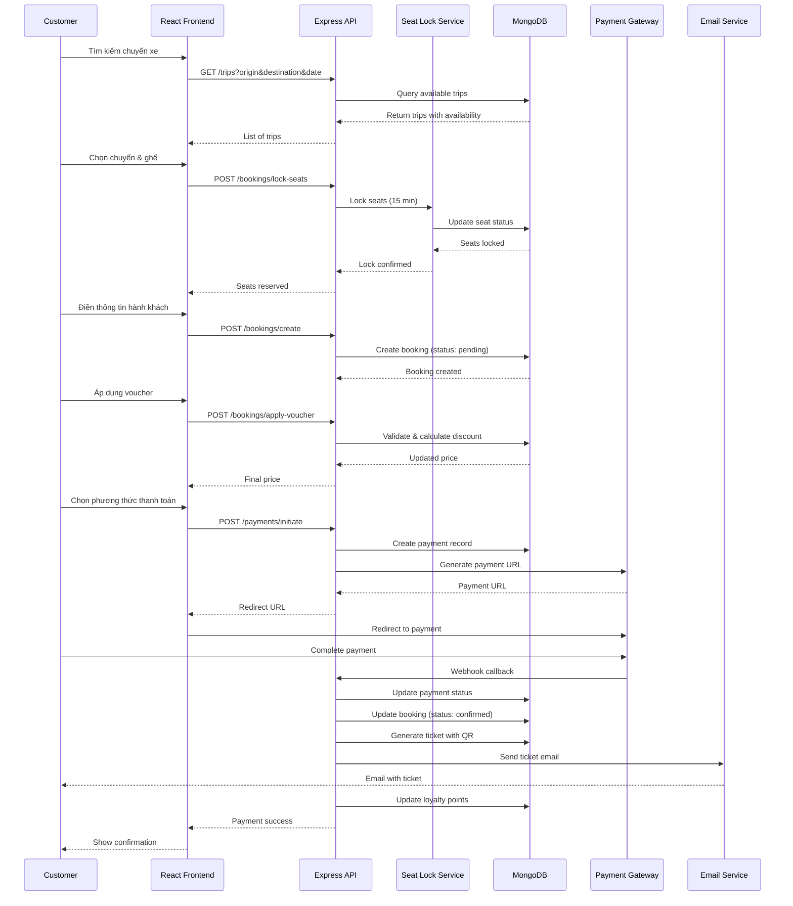

## 4. Luồng Quản Lý Chuyến Đi (Trip Manager)

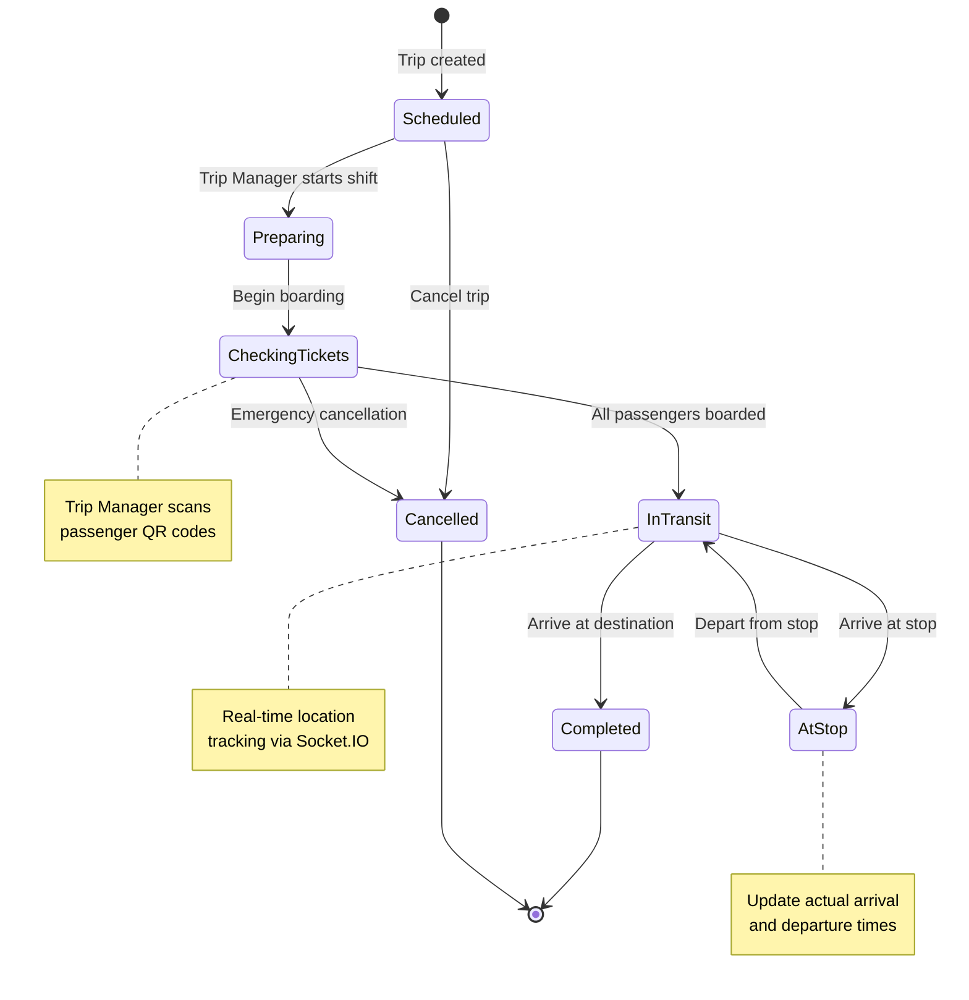

## 5. Sơ Đồ Database - Quan Hệ Chính

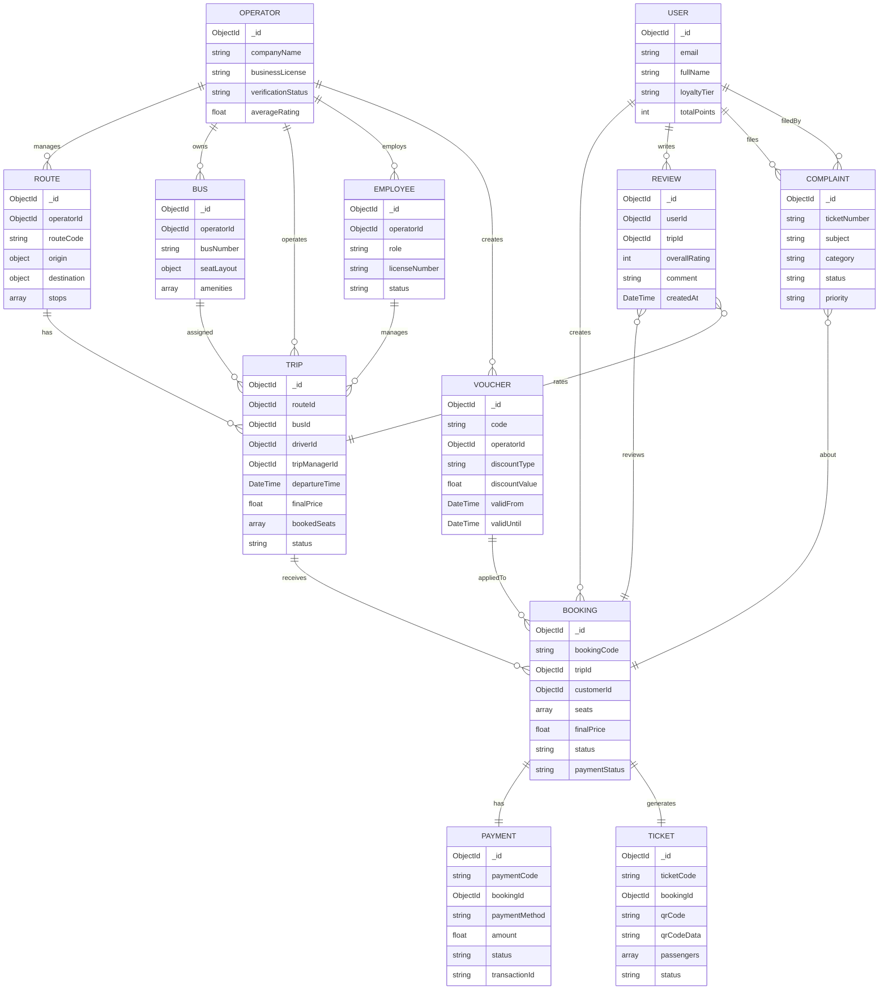

## 6. Luồng Thanh Toán

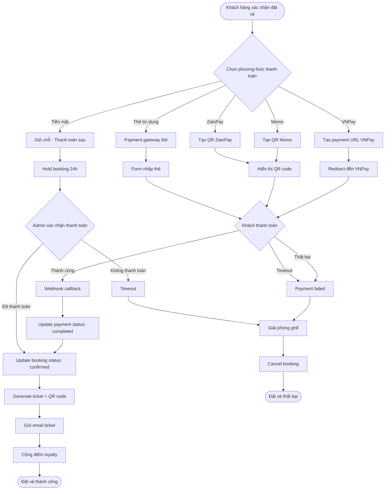

## 7. Hệ Thống Loyalty Points

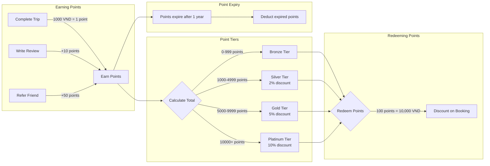

## 8. Quy Trình Xác Minh Vé (QR Code)

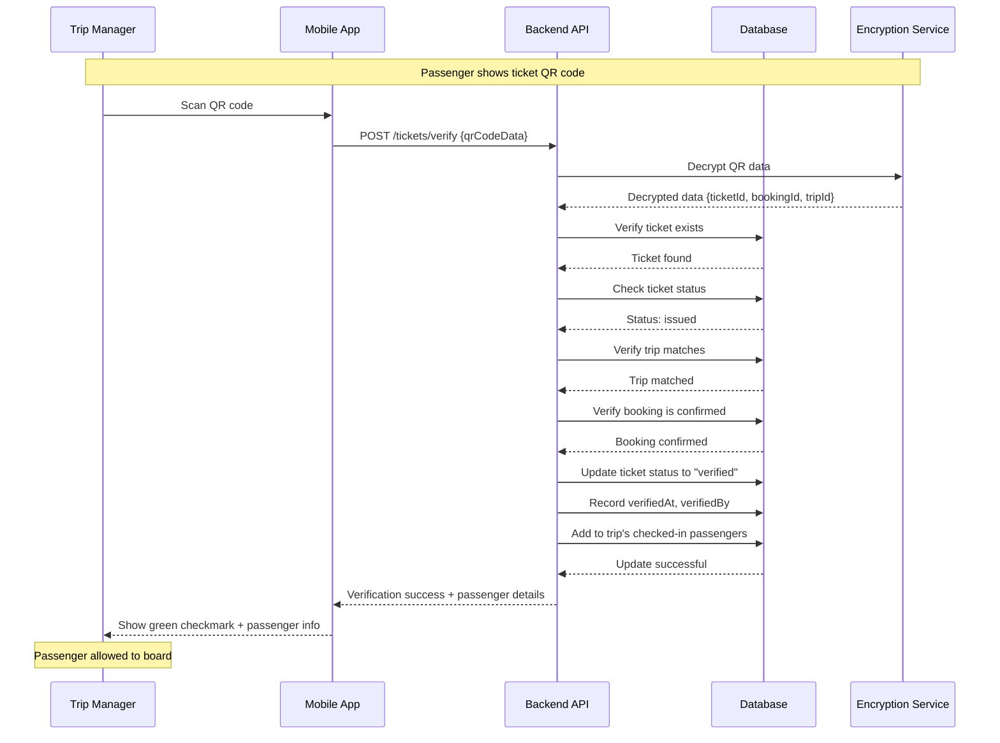

## 9. Workflow Operator

## 10. Complaint Resolution Flow

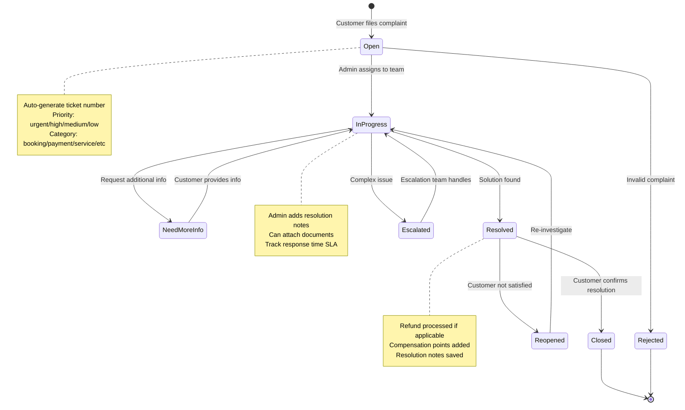

## 11. Real-time Updates với Socket.IO

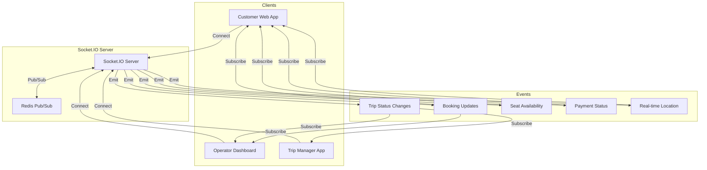

## 12. Seat Locking Mechanism

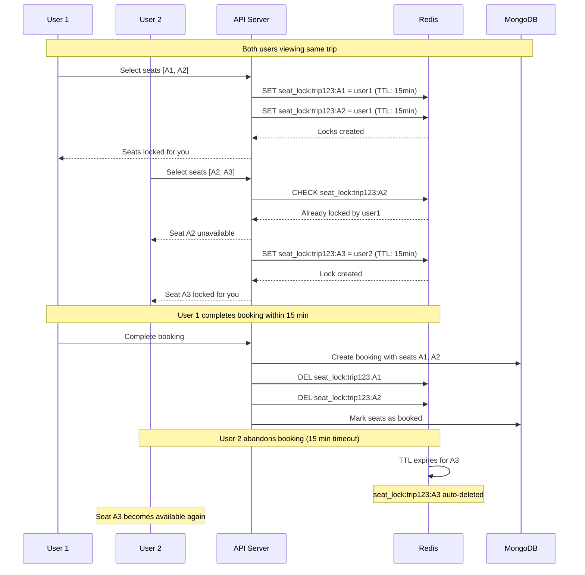

---

## Tổng Kết Kiến Trúc

### Công Nghệ Sử Dụng

| Thành phần | Công nghệ |
|------------|-----------|
| **Frontend** | React 18 + Vite + Tailwind CSS + Ant Design |
| **State Management** | Zustand (with persistence) |
| **Real-time** | Socket.IO |
| **Backend** | Express.js + Node.js |
| **Database** | MongoDB + Mongoose |
| **Caching** | Redis |
| **Authentication** | JWT Tokens |
| **File Storage** | Cloudinary |
| **Payment** | VNPay, Momo, ZaloPay |
| **QR Codes** | qrcode + crypto encryption |
| **Email** | Nodemailer + Resend |
| **Testing** | Jest + Vitest + React Testing Library |

### Đặc Điểm Nổi Bật

1. **Multi-tenant System**: Hỗ trợ nhiều nhà xe độc lập
2. **Real-time Updates**: Socket.IO cho thông tin chuyến xe và ghế trống
3. **Dynamic Pricing**: Giá linh hoạt theo nhu cầu, giờ cao điểm, cuối tuần
4. **Loyalty Program**: 4 tier với điểm thưởng tự động
5. **Seat Locking**: Redis-based locking mechanism (15 phút)
6. **QR Code Verification**: Mã hóa QR code để bảo mật
7. **Guest Booking**: Không bắt buộc tài khoản
8. **Recurring Trips**: Tạo chuyến xe định kỳ tự động
9. **Multi-payment**: 6 phương thức thanh toán
10. **Responsive Design**: Mobile-first approach
