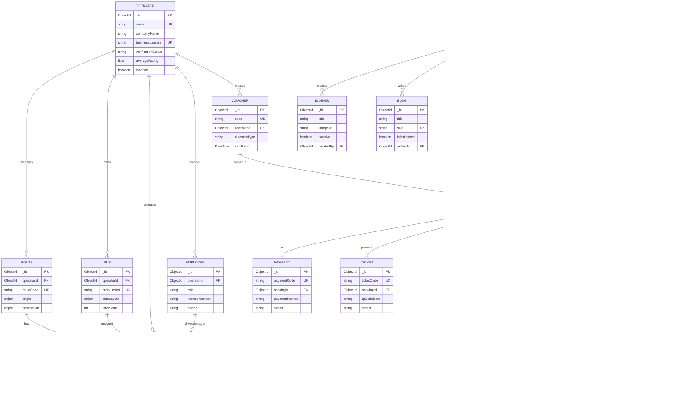

# Sơ Đồ Hệ Thống QuikRide Bus Booking

## 1. Kiến Trúc Tổng Quan


## 2. Phân Quyền Người Dùng


## 3. Luồng Đặt Vé Của Khách Hàng


## 4. Luồng Quản Lý Chuyến Đi (Trip Manager)


## 5. Sơ Đồ Database

### 5.1. Tổng Quan Quan Hệ Database



### 5.2. User Management - Chi Tiết


### 5.3. Transportation System - Chi Tiết


### 5.4. Booking & Payment System - Chi Tiết


### 5.5. Reviews & Vouchers - Chi Tiết


### 5.6. Content Management - Chi Tiết


### 5.7. Indexes và Constraints


## 6. Class Diagram (UML) - Tổng Quan & Chi Tiết

### 6.0. Class Diagram Tổng Quan - Toàn Bộ Hệ Thống


### 6.1. User Management Classes


### 6.2. Transportation System Classes


### 6.3. Booking & Payment Classes


### 6.4. Review & Complaint Classes


### 6.5. Content Management Classes


### 6.6. Service Classes


## 7. Payment System - Class Diagram & Flow

### 7.1. Payment System Class Diagram


### 7.2. Payment Flow Sequence Diagram


### 7.3. Payment State Machine

```mermaid
stateDiagram-v2
    [*] --> Pending: Payment initiated

    Pending --> Processing: Gateway request sent
    Processing --> Completed: Payment successful
    Processing --> Failed: Payment declined
    Processing --> Timeout: Gateway timeout

    Pending --> Cancelled: User cancelled
    Processing --> Cancelled: User cancelled

    Completed --> Refunding: Refund requested
    Refunding --> Refunded: Refund processed
    Refunding --> RefundFailed: Refund declined

    Failed --> [*]
    Timeout --> [*]
    Cancelled --> [*]
    Refunded --> [*]
    RefundFailed --> [*]

    note right of Completed
        Booking confirmed
        Ticket generated
        Email sent
    end note

    note right of Refunding
        Calculate refund amount
        Process via gateway
        Update booking status
    end note
```

### 7.4. Payment Gateway Integration Details

```mermaid
classDiagram
    class PaymentRequest {
        +ObjectId bookingId
        +Float amount
        +String currency
        +String returnUrl
        +String cancelUrl
        +Object customerInfo
        +validate()
    }

    class PaymentResponse {
        +String transactionId
        +String paymentUrl
        +String qrCode
        +String status
        +DateTime expiredAt
    }

    class WebhookData {
        +String transactionId
        +String status
        +Float amount
        +String signature
        +DateTime transactionTime
        +Object rawData
        +verify()
    }

    class RefundRequest {
        +ObjectId paymentId
        +String transactionId
        +Float refundAmount
        +String reason
    }

    class RefundResponse {
        +String refundId
        +String status
        +Float refundedAmount
        +DateTime refundedAt
    }

    PaymentGateway --> PaymentRequest : accepts
    PaymentGateway --> PaymentResponse : returns
    PaymentGateway --> WebhookData : processes
    PaymentGateway --> RefundRequest : accepts
    PaymentGateway --> RefundResponse : returns
```

### 7.5. Luồng Thanh Toán Tổng Quan (Flowchart)

```mermaid
flowchart TD
    START([Khách hàng xác nhận đặt vé]) --> SELECT{Chọn phương thức thanh toán}

    SELECT -->|VNPay| VNPAY[PaymentProcessor<br/>selectGateway VNPay]
    SELECT -->|Momo| MOMO[PaymentProcessor<br/>selectGateway Momo]
    SELECT -->|ZaloPay| ZALO[PaymentProcessor<br/>selectGateway ZaloPay]
    SELECT -->|Thẻ tín dụng| CARD[Payment gateway thẻ]
    SELECT -->|Tiền mặt| CASH[CashPayment<br/>holdBooking 24h]

    VNPAY --> REDIRECT[Redirect đến VNPay]
    MOMO --> QRCODE[Hiển thị QR code]
    ZALO --> QRCODE
    CARD --> CARDFORM[Form nhập thẻ]

    REDIRECT --> CUSTOMER_PAY{Khách thanh toán}
    QRCODE --> CUSTOMER_PAY
    CARDFORM --> CUSTOMER_PAY

    CUSTOMER_PAY -->|Thành công| WEBHOOK[Webhook callback<br/>verifySignature]
    CUSTOMER_PAY -->|Thất bại| FAILED
    CUSTOMER_PAY -->|Timeout| FAILED

    WEBHOOK --> VERIFY{Signature<br/>valid?}
    VERIFY -->|Yes| UPDATE_PAYMENT[Update Payment<br/>status: completed]
    VERIFY -->|No| FAILED

    UPDATE_PAYMENT --> UPDATE_BOOKING[Update Booking<br/>status: confirmed]
    UPDATE_BOOKING --> GEN_TICKET[Generate Ticket<br/>with QR code]
    GEN_TICKET --> LOG_TRANSACTION[Log to<br/>TransactionLog]
    LOG_TRANSACTION --> SEND_EMAIL[NotificationService<br/>sendTicket]
    SEND_EMAIL --> ADD_POINTS[LoyaltyService<br/>addPoints]
    ADD_POINTS --> SUCCESS([Đặt vé thành công])

    CASH --> HOLD[Hold booking 24h<br/>isHeld: true]
    HOLD --> MANUAL_CONFIRM{Admin xác nhận<br/>thanh toán}
    MANUAL_CONFIRM -->|Đã thanh toán| UPDATE_PAYMENT
    MANUAL_CONFIRM -->|Không thanh toán| TIMEOUT

    FAILED[Payment failed<br/>TransactionLog] --> RELEASE_SEATS[SeatLockService<br/>releaseSeat]
    TIMEOUT[Timeout] --> RELEASE_SEATS
    RELEASE_SEATS --> CANCEL_BOOKING[Cancel booking<br/>status: cancelled]
    CANCEL_BOOKING --> END([Đặt vé thất bại])
```

## 8. Hệ Thống Loyalty Points

```mermaid
graph LR
    subgraph "Earning Points"
        BOOK[Complete Trip] -->|1000 VND = 1 point| EARN[Earn Points]
        REVIEW[Write Review] -->|+10 points| EARN
        REFERRAL[Refer Friend] -->|+50 points| EARN
    end

    subgraph "Point Tiers"
        EARN --> CALC{Calculate Total}
        CALC -->|0-999 points| BRONZE[Bronze Tier]
        CALC -->|1000-4999 points| SILVER[Silver Tier<br/>2% discount]
        CALC -->|5000-9999 points| GOLD[Gold Tier<br/>5% discount]
        CALC -->|10000+ points| PLATINUM[Platinum Tier<br/>10% discount]
    end

    subgraph "Redeeming Points"
        BRONZE --> REDEEM{Redeem Points}
        SILVER --> REDEEM
        GOLD --> REDEEM
        PLATINUM --> REDEEM

        REDEEM -->|100 points = 10,000 VND| DISCOUNT[Discount on Booking]
    end

    subgraph "Point Expiry"
        EARN --> EXPIRY[Points expire after 1 year]
        EXPIRY --> DEDUCT[Deduct expired points]
    end
```

## 9. Quy Trình Xác Minh Vé (QR Code)

```mermaid
sequenceDiagram
    participant TM as Trip Manager
    participant APP as Mobile App
    participant API as Backend API
    participant DB as Database
    participant CRYPT as Encryption Service

    Note over TM,CRYPT: Passenger shows ticket QR code

    TM->>APP: Scan QR code
    APP->>API: POST /tickets/verify {qrCodeData}

    API->>CRYPT: Decrypt QR data
    CRYPT-->>API: Decrypted data {ticketId, bookingId, tripId}

    API->>DB: Verify ticket exists
    DB-->>API: Ticket found

    API->>DB: Check ticket status
    DB-->>API: Status: issued

    API->>DB: Verify trip matches
    DB-->>API: Trip matched

    API->>DB: Verify booking is confirmed
    DB-->>API: Booking confirmed

    API->>DB: Update ticket status to "verified"
    API->>DB: Record verifiedAt, verifiedBy
    API->>DB: Add to trip's checked-in passengers

    DB-->>API: Update successful

    API-->>APP: Verification success + passenger details
    APP-->>TM: Show green checkmark + passenger info

    Note over TM: Passenger allowed to board
```

## 10. Workflow Operator

```mermaid
flowchart TD
    START([Operator đăng ký]) --> SUBMIT[Submit business info<br/>Business license, Tax code]
    SUBMIT --> PENDING[Status: Pending verification]

    PENDING --> ADMIN_REVIEW{Admin review}
    ADMIN_REVIEW -->|Approved| ACTIVE[Status: Active]
    ADMIN_REVIEW -->|Rejected| REJECTED[Status: Rejected<br/>Reason provided]

    ACTIVE --> SETUP[Setup Operations]

    SETUP --> ROUTE[Create Routes<br/>Origin, Destination, Stops]
    SETUP --> BUS[Add Buses<br/>Seat layout, Amenities]
    SETUP --> EMP[Add Employees<br/>Drivers, Trip Managers]

    ROUTE --> TRIP[Create Trips]
    BUS --> TRIP
    EMP --> TRIP

    TRIP --> PRICING[Set Pricing<br/>Base price, Dynamic pricing]
    PRICING --> SCHEDULE[Schedule Trips<br/>One-time or Recurring]

    SCHEDULE --> VOUCHER[Create Vouchers<br/>Optional]
    VOUCHER --> MONITOR[Monitor Bookings]

    MONITOR --> REPORTS[View Reports<br/>Revenue, Occupancy]
    REPORTS --> MANAGE{Manage Operations}

    MANAGE -->|Update| ROUTE
    MANAGE -->|Update| BUS
    MANAGE -->|Update| TRIP
    MANAGE -->|Create new| SCHEDULE
```

## 11. Complaint Resolution Flow

```mermaid
stateDiagram-v2
    [*] --> Open: Customer files complaint

    Open --> InProgress: Admin assigns to team
    InProgress --> NeedMoreInfo: Request additional info
    NeedMoreInfo --> InProgress: Customer provides info

    InProgress --> Resolved: Solution found
    InProgress --> Escalated: Complex issue

    Escalated --> InProgress: Escalation team handles

    Resolved --> Closed: Customer confirms resolution
    Resolved --> Reopened: Customer not satisfied

    Reopened --> InProgress: Re-investigate

    Open --> Rejected: Invalid complaint

    Closed --> [*]
    Rejected --> [*]

    note right of Open
        Auto-generate ticket number
        Priority: urgent/high/medium/low
        Category: booking/payment/service/etc
    end note

    note right of InProgress
        Admin adds resolution notes
        Can attach documents
        Track response time SLA
    end note

    note right of Resolved
        Refund processed if applicable
        Compensation points added
        Resolution notes saved
    end note
```

## 12. Real-time Updates với Socket.IO

```mermaid
graph TB
    subgraph "Clients"
        CUSTOMER[Customer Web App]
        OPERATOR[Operator Dashboard]
        TRIPMGR[Trip Manager App]
    end

    subgraph "Socket.IO Server"
        SOCKET[Socket.IO Server]
        REDIS[Redis Pub/Sub]
    end

    subgraph "Events"
        BOOK_UPDATE[Booking Updates]
        TRIP_STATUS[Trip Status Changes]
        SEAT_AVAIL[Seat Availability]
        PAYMENT_STATUS[Payment Status]
        LOCATION[Real-time Location]
    end

    CUSTOMER -->|Connect| SOCKET
    OPERATOR -->|Connect| SOCKET
    TRIPMGR -->|Connect| SOCKET

    SOCKET <-->|Pub/Sub| REDIS

    SOCKET -->|Emit| BOOK_UPDATE
    SOCKET -->|Emit| TRIP_STATUS
    SOCKET -->|Emit| SEAT_AVAIL
    SOCKET -->|Emit| PAYMENT_STATUS
    SOCKET -->|Emit| LOCATION

    BOOK_UPDATE -->|Subscribe| CUSTOMER
    SEAT_AVAIL -->|Subscribe| CUSTOMER
    PAYMENT_STATUS -->|Subscribe| CUSTOMER

    BOOK_UPDATE -->|Subscribe| OPERATOR
    TRIP_STATUS -->|Subscribe| OPERATOR

    LOCATION -->|Subscribe| CUSTOMER
    TRIP_STATUS -->|Subscribe| TRIPMGR
```

## 13. Seat Locking Mechanism

```mermaid
sequenceDiagram
    participant U1 as User 1
    participant U2 as User 2
    participant API as API Server
    participant REDIS as Redis
    participant DB as MongoDB

    Note over U1,DB: Both users viewing same trip

    U1->>API: Select seats [A1, A2]
    API->>REDIS: SET seat_lock:trip123:A1 = user1 (TTL: 15min)
    API->>REDIS: SET seat_lock:trip123:A2 = user1 (TTL: 15min)
    REDIS-->>API: Locks created
    API-->>U1: Seats locked for you

    U2->>API: Select seats [A2, A3]
    API->>REDIS: CHECK seat_lock:trip123:A2
    REDIS-->>API: Already locked by user1
    API-->>U2: Seat A2 unavailable

    API->>REDIS: SET seat_lock:trip123:A3 = user2 (TTL: 15min)
    REDIS-->>API: Lock created
    API-->>U2: Seat A3 locked for you

    Note over U1,REDIS: User 1 completes booking within 15 min

    U1->>API: Complete booking
    API->>DB: Create booking with seats A1, A2
    API->>REDIS: DEL seat_lock:trip123:A1
    API->>REDIS: DEL seat_lock:trip123:A2
    API->>DB: Mark seats as booked

    Note over U2,REDIS: User 2 abandons booking (15 min timeout)

    REDIS->>REDIS: TTL expires for A3
    Note over REDIS: seat_lock:trip123:A3 auto-deleted

    Note over U2: Seat A3 becomes available again
```

---

## 14. Danh Sách Chức Năng Hệ Thống

### 14.1. Chức Năng Khách Hàng (Customer/User)

#### Xác Thực & Quản Lý Tài Khoản
| STT | Chức Năng | Mô Tả |
|-----|-----------|-------|
| 1 | Đăng ký tài khoản | Đăng ký bằng email hoặc số điện thoại với xác thực |
| 2 | Đăng nhập | Đăng nhập bằng email hoặc số điện thoại |
| 3 | Đăng nhập OAuth | Đăng nhập bằng Google hoặc Facebook |
| 4 | Xác thực email | Xác thực địa chỉ email bằng mã token |
| 5 | Xác thực điện thoại | Xác thực số điện thoại bằng OTP |
| 6 | Quên mật khẩu | Yêu cầu đặt lại mật khẩu qua email |
| 7 | Đặt lại mật khẩu | Tạo mật khẩu mới bằng token |
| 8 | Đổi mật khẩu | Cập nhật mật khẩu cho người dùng đã đăng nhập |
| 9 | Quản lý thông tin cá nhân | Xem và cập nhật hồ sơ (tên, ngày sinh, giới tính, ảnh đại diện) |
| 10 | Tải lên ảnh đại diện | Tải lên và quản lý ảnh đại diện |
| 11 | Xóa ảnh đại diện | Xóa ảnh đại diện hiện tại |
| 12 | Đăng xuất | Kết thúc phiên đăng nhập |

#### Tìm Kiếm & Đặt Vé
| STT | Chức Năng | Mô Tả |
|-----|-----------|-------|
| 13 | Tìm kiếm chuyến xe | Tìm kiếm theo điểm đi, điểm đến, ngày, giờ (Công khai) |
| 14 | Xem chi tiết chuyến | Xem thông tin chi tiết về chuyến xe (Công khai) |
| 15 | Kiểm tra giá động | Xem giá theo thời gian thực dựa trên nhu cầu |
| 16 | Xem sơ đồ ghế | Xem sơ đồ ghế trống và đã đặt |
| 17 | Chọn ghế | Chọn ghế ngồi trên sơ đồ tương tác |
| 18 | Giữ chỗ | Giữ ghế tạm thời (15 phút) |
| 19 | Gia hạn giữ chỗ | Kéo dài thời gian giữ chỗ |
| 20 | Hủy giữ chỗ | Hủy ghế đang giữ |
| 21 | Nhập thông tin hành khách | Nhập thông tin cho từng ghế |
| 22 | Hành khách thường dùng | Lưu/xóa hành khách thường đi (tối đa 5 người) |
| 23 | Xác nhận đặt vé | Xác nhận và tạo đơn đặt vé |
| 24 | Đặt vé khách | Đặt vé không cần tài khoản (với xác thực OTP) |

#### Thanh Toán & Voucher
| STT | Chức Năng | Mô Tả |
|-----|-----------|-------|
| 25 | Xem phương thức thanh toán | Xem các tùy chọn thanh toán có sẵn |
| 26 | Thanh toán VNPay | Thanh toán qua cổng VNPay |
| 27 | Xem danh sách ngân hàng | Xem ngân hàng hỗ trợ cho VNPay |
| 28 | Tạo giao dịch thanh toán | Tạo giao dịch thanh toán mới |
| 29 | Kiểm tra trạng thái thanh toán | Truy vấn trạng thái giao dịch |
| 30 | Lịch sử thanh toán | Xem tất cả giao dịch thanh toán |
| 31 | Áp dụng voucher | Áp dụng và xác thực mã giảm giá |
| 32 | Xem voucher công khai | Duyệt voucher có sẵn |

#### Quản Lý Vé
| STT | Chức Năng | Mô Tả |
|-----|-----------|-------|
| 33 | Vé của tôi | Xem tất cả vé (sắp tới, đã đi, đã hủy) |
| 34 | Lọc vé | Lọc theo trạng thái, thời gian, mã đặt vé |
| 35 | Chi tiết vé | Xem thông tin chi tiết vé với mã QR |
| 36 | Tải vé PDF | Tải vé dạng PDF |
| 37 | Gửi lại vé | Gửi lại vé qua email/SMS |
| 38 | Hủy vé | Hủy vé và tính hoàn tiền |
| 39 | Đổi vé | Đổi sang chuyến khác |
| 40 | Tra cứu vé khách | Tra cứu vé không cần đăng nhập (với OTP) |

#### Chương Trình Khách Hàng Thân Thiết
| STT | Chức Năng | Mô Tả |
|-----|-----------|-------|
| 41 | Tổng quan điểm thưởng | Xem điểm, hạng, và quyền lợi |
| 42 | Lịch sử điểm | Xem lịch sử giao dịch điểm |
| 43 | Tích điểm | Tự động tích điểm từ đặt vé |
| 44 | Đổi điểm | Đổi điểm lấy giảm giá |
| 45 | Hệ thống hạng | 4 hạng: Đồng, Bạc, Vàng, Bạch Kim |
| 46 | Quyền lợi theo hạng | Giảm giá và đặc quyền theo hạng |

#### Đánh Giá & Phản Hồi
| STT | Chức Năng | Mô Tả |
|-----|-----------|-------|
| 47 | Tạo đánh giá | Đánh giá chuyến đã hoàn thành (1-5 sao) |
| 48 | Đánh giá đa khía cạnh | Đánh giá xe, tài xế, đúng giờ, dịch vụ |
| 49 | Đánh giá kèm ảnh | Tải lên tối đa 5 ảnh |
| 50 | Đánh giá của tôi | Xem tất cả đánh giá đã gửi |
| 51 | Xem đánh giá chuyến | Xem đánh giá của chuyến cụ thể |
| 52 | Xem đánh giá nhà xe | Xem đánh giá của nhà xe |
| 53 | Lời mời đánh giá | Nhận email mời đánh giá |

#### Khiếu Nại & Hỗ Trợ
| STT | Chức Năng | Mô Tả |
|-----|-----------|-------|
| 54 | Tạo khiếu nại | Gửi khiếu nại với danh mục và độ ưu tiên |
| 55 | Danh mục khiếu nại | Đặt vé, thanh toán, dịch vụ, tài xế, xe, hoàn tiền, kỹ thuật, khác |
| 56 | Khiếu nại của tôi | Xem tất cả khiếu nại đã gửi |
| 57 | Chi tiết khiếu nại | Xem trạng thái và cập nhật |
| 58 | Thêm ghi chú | Thêm ghi chú/bình luận vào khiếu nại |
| 59 | Đánh giá mức độ hài lòng | Đánh giá khiếu nại đã giải quyết |

#### Nội Dung & Thông Tin
| STT | Chức Năng | Mô Tả |
|-----|-----------|-------|
| 60 | Xem tin tức/blog | Đọc bài viết tin tức và blog |
| 61 | Xem FAQ | Xem câu hỏi thường gặp |
| 62 | Xem banner quảng cáo | Xem banner khuyến mãi |
| 63 | Tuyến đường phổ biến | Xem tuyến đường xu hướng/phổ biến |

---

### 14.2. Chức Năng Nhà Xe (Operator)

#### Xác Thực & Hồ Sơ
| STT | Chức Năng | Mô Tả |
|-----|-----------|-------|
| 64 | Đăng ký nhà xe | Đăng ký công ty vận tải |
| 65 | Đăng nhập nhà xe | Đăng nhập vào bảng điều khiển |
| 66 | Quản lý hồ sơ | Xem và cập nhật hồ sơ nhà xe |
| 67 | Xem chi tiết hồ sơ | Lấy thông tin nhà xe |

#### Dashboard & Báo Cáo
| STT | Chức Năng | Mô Tả |
|-----|-----------|-------|
| 68 | Thống kê dashboard | Xem chỉ số chính (doanh thu, đặt vé, chuyến) |
| 69 | Báo cáo doanh thu | Phân tích doanh thu chi tiết |
| 70 | Tổng quan doanh thu | Tổng quan doanh thu nhanh |
| 71 | Doanh thu theo tuyến | Phân tích doanh thu theo tuyến |
| 72 | Xu hướng doanh thu | Xu hướng theo ngày/tuần/tháng |
| 73 | Báo cáo hủy vé | Phân tích hủy đặt vé |
| 74 | Chỉ số tăng trưởng | Chỉ số phát triển kinh doanh |
| 75 | Xuất Excel | Tải báo cáo dạng Excel |
| 76 | Xuất PDF | Tải báo cáo dạng PDF |

#### Quản Lý Tuyến Đường
| STT | Chức Năng | Mô Tả |
|-----|-----------|-------|
| 77 | Tạo tuyến đường | Định nghĩa tuyến xe mới |
| 78 | Xem tuyến đường | Danh sách tất cả tuyến |
| 79 | Chi tiết tuyến | Xem thông tin chi tiết tuyến |
| 80 | Cập nhật tuyến | Sửa thông tin tuyến |
| 81 | Xóa tuyến | Xóa tuyến đường |
| 82 | Bật/Tắt tuyến | Kích hoạt/vô hiệu hóa tuyến |
| 83 | Thêm điểm đón | Định nghĩa điểm đón khách |
| 84 | Xóa điểm đón | Xóa điểm đón |
| 85 | Thêm điểm trả | Định nghĩa điểm trả khách |
| 86 | Xóa điểm trả | Xóa điểm trả |

#### Quản Lý Đội Xe
| STT | Chức Năng | Mô Tả |
|-----|-----------|-------|
| 87 | Thêm xe | Thêm xe mới vào đội |
| 88 | Xem danh sách xe | Danh sách tất cả xe |
| 89 | Chi tiết xe | Xem thông tin chi tiết xe |
| 90 | Cập nhật xe | Sửa thông tin xe |
| 91 | Xóa xe | Xóa xe khỏi đội |
| 92 | Đổi trạng thái xe | Đặt xe hoạt động/bảo trì/ngưng hoạt động |
| 93 | Thống kê đội xe | Xem thống kê đội xe |
| 94 | Mẫu sơ đồ ghế | Sử dụng sơ đồ ghế có sẵn |
| 95 | Tùy chỉnh sơ đồ ghế | Tạo sơ đồ ghế tùy chỉnh |
| 96 | Xác thực sơ đồ ghế | Kiểm tra cấu hình ghế |

#### Quản Lý Nhân Viên
| STT | Chức Năng | Mô Tả |
|-----|-----------|-------|
| 97 | Thêm nhân viên | Thêm tài xế và quản lý chuyến |
| 98 | Xem nhân viên | Danh sách tất cả nhân viên |
| 99 | Chi tiết nhân viên | Xem thông tin nhân viên |
| 100 | Cập nhật nhân viên | Sửa thông tin nhân viên |
| 101 | Xóa nhân viên | Xóa nhân viên |
| 102 | Đổi trạng thái nhân viên | Đặt hoạt động/không hoạt động/tạm ngưng |
| 103 | Thống kê nhân viên | Xem chỉ số nhân viên |
| 104 | Nhân viên khả dụng | Tìm nhân viên cho phân công |
| 105 | Đặt lại mật khẩu nhân viên | Reset mật khẩu đăng nhập |

#### Quản Lý Chuyến Xe
| STT | Chức Năng | Mô Tả |
|-----|-----------|-------|
| 106 | Tạo chuyến | Lên lịch chuyến mới |
| 107 | Tạo chuyến định kỳ | Lên lịch chuyến lặp lại |
| 108 | Xem chuyến | Danh sách tất cả chuyến |
| 109 | Chi tiết chuyến | Xem thông tin chuyến |
| 110 | Cập nhật chuyến | Sửa thông tin chuyến |
| 111 | Xóa chuyến | Xóa chuyến |
| 112 | Hủy chuyến | Hủy chuyến đã lên lịch |
| 113 | Thống kê chuyến | Xem chỉ số chuyến |
| 114 | Cấu hình giá động | Cấu hình giá tăng, giảm giá sớm |
| 115 | Giá theo nhu cầu | Tự động điều chỉnh giá theo tỷ lệ đặt |
| 116 | Phụ phí giờ cao điểm | Giá phụ thu giờ cao điểm |
| 117 | Phụ phí cuối tuần | Phụ thu cuối tuần |
| 118 | Giảm giá đặt sớm | Giảm giá cho đặt vé trước |

#### Quản Lý Đặt Vé
| STT | Chức Năng | Mô Tả |
|-----|-----------|-------|
| 119 | Xem đặt vé | Danh sách đặt vé của nhà xe |
| 120 | Thống kê đặt vé | Xem chỉ số đặt vé |
| 121 | Cập nhật thanh toán | Đánh dấu thanh toán đã nhận |
| 122 | Lọc đặt vé | Lọc theo trạng thái, ngày, thanh toán |

#### Quản Lý Voucher
| STT | Chức Năng | Mô Tả |
|-----|-----------|-------|
| 123 | Tạo voucher | Tạo mã giảm giá |
| 124 | Xem voucher | Danh sách tất cả voucher |
| 125 | Chi tiết voucher | Xem thông tin voucher |
| 126 | Cập nhật voucher | Sửa thông tin voucher |
| 127 | Xóa voucher | Xóa voucher |
| 128 | Kích hoạt voucher | Bật voucher để sử dụng |
| 129 | Vô hiệu voucher | Tắt voucher |
| 130 | Thống kê voucher | Xem thống kê sử dụng |
| 131 | Báo cáo voucher | Phân tích sử dụng chi tiết |

#### Thanh Toán & Hoàn Tiền
| STT | Chức Năng | Mô Tả |
|-----|-----------|-------|
| 132 | Xem thanh toán | Danh sách tất cả thanh toán |
| 133 | Thống kê thanh toán | Phân tích thanh toán |
| 134 | Xử lý hoàn tiền | Hoàn tiền cho hủy vé |

#### Quản Lý Đánh Giá
| STT | Chức Năng | Mô Tả |
|-----|-----------|-------|
| 135 | Phản hồi đánh giá | Trả lời đánh giá khách hàng |
| 136 | Xem đánh giá nhà xe | Xem tất cả đánh giá nhà xe |

---

### 14.3. Chức Năng Nhân Viên (Employee - Trip Manager & Driver)

#### Xác Thực
| STT | Chức Năng | Mô Tả |
|-----|-----------|-------|
| 137 | Đăng nhập nhân viên | Đăng nhập bằng username/password |
| 138 | Xem hồ sơ | Lấy thông tin nhân viên |

#### Quản Lý Chuyến (Trip Manager & Driver)
| STT | Chức Năng | Mô Tả |
|-----|-----------|-------|
| 139 | Chuyến được phân công | Xem chuyến được giao |
| 140 | Chi tiết chuyến | Xem thông tin chuyến và hành khách |
| 141 | Bắt đầu chuyến | Khởi động thực hiện chuyến |
| 142 | Hoàn thành chuyến | Đánh dấu chuyến hoàn thành |
| 143 | Cập nhật trạng thái chuyến | Đổi trạng thái (đã lên lịch, đang đi, hoàn thành, hủy) |
| 144 | Hủy chuyến | Hủy chuyến với lý do |

#### Xác Minh Vé (Trip Manager)
| STT | Chức Năng | Mô Tả |
|-----|-----------|-------|
| 145 | Xem hành khách | Danh sách tất cả hành khách trên chuyến |
| 146 | Quét mã QR | Quét và xác minh mã QR vé |
| 147 | Xác thực vé | Kiểm tra tính hợp lệ vé |
| 148 | Check-in hành khách | Đánh dấu hành khách đã lên xe |

#### Theo Dõi Hành Trình (Trip Manager)
| STT | Chức Năng | Mô Tả |
|-----|-----------|-------|
| 149 | Xem chi tiết hành trình | Xem điểm dừng và lịch sử trạng thái |
| 150 | Cập nhật trạng thái hành trình | Cập nhật vị trí/trạng thái hiện tại |
| 151 | Trạng thái hành trình | Chuẩn bị, kiểm vé, đang đi, tại điểm dừng, hoàn thành |
| 152 | Quản lý điểm dừng | Đánh dấu đến điểm dừng |
| 153 | Cập nhật vị trí | Ghi vị trí GPS |
| 154 | Ghi chú hành trình | Thêm ghi chú trong chuyến |
| 155 | Theo dõi thời gian thực tế | Ghi thời gian khởi hành/đến thực tế |

---

### 14.4. Chức Năng Quản Trị Viên (Admin)

#### Xác Thực
| STT | Chức Năng | Mô Tả |
|-----|-----------|-------|
| 156 | Đăng nhập admin | Đăng nhập vào trang quản trị |
| 157 | Xem hồ sơ | Lấy thông tin admin |

#### Quản Lý Người Dùng (UC-22)
| STT | Chức Năng | Mô Tả |
|-----|-----------|-------|
| 158 | Xem người dùng | Danh sách tất cả khách hàng |
| 159 | Chi tiết người dùng | Xem thông tin người dùng chi tiết |
| 160 | Chặn người dùng | Chặn tài khoản với lý do |
| 161 | Mở chặn người dùng | Khôi phục quyền truy cập |
| 162 | Đặt lại mật khẩu người dùng | Reset mật khẩu người dùng |
| 163 | Thống kê người dùng | Xem chỉ số và phân tích người dùng |

#### Quản Lý Nhà Xe (UC-23)
| STT | Chức Năng | Mô Tả |
|-----|-----------|-------|
| 164 | Xem nhà xe | Danh sách tất cả nhà xe |
| 165 | Chi tiết nhà xe | Xem thông tin nhà xe |
| 166 | Duyệt nhà xe | Duyệt đăng ký nhà xe chờ |
| 167 | Từ chối nhà xe | Từ chối đăng ký với lý do |
| 168 | Tạm ngưng nhà xe | Tạm ngưng hoạt động nhà xe |
| 169 | Khôi phục nhà xe | Khôi phục nhà xe đã tạm ngưng |

#### Quản Lý Khiếu Nại (UC-25)
| STT | Chức Năng | Mô Tả |
|-----|-----------|-------|
| 170 | Xem tất cả khiếu nại | Danh sách tất cả khiếu nại hệ thống |
| 171 | Thống kê khiếu nại | Xem chỉ số khiếu nại |
| 172 | Phân công khiếu nại | Phân công khiếu nại cho admin |
| 173 | Cập nhật trạng thái | Đổi trạng thái khiếu nại |
| 174 | Cập nhật độ ưu tiên | Đổi độ ưu tiên khiếu nại |
| 175 | Giải quyết khiếu nại | Đánh dấu khiếu nại đã giải quyết |
| 176 | Lọc khiếu nại | Lọc theo trạng thái, danh mục, độ ưu tiên |

#### Quản Lý Nội Dung (UC-24)
| STT | Chức Năng | Mô Tả |
|-----|-----------|-------|
| 177 | Quản lý Banner | Tạo, cập nhật, xóa banner quảng cáo |
| 178 | Quản lý Blog | Tạo, cập nhật, xóa bài blog |
| 179 | Quản lý FAQ | Tạo, cập nhật, xóa FAQ |
| 180 | Thống kê nội dung | Xem chỉ số tương tác nội dung |

#### Báo Cáo Hệ Thống (UC-26)
| STT | Chức Năng | Mô Tả |
|-----|-----------|-------|
| 181 | Tổng quan hệ thống | Xem thống kê toàn hệ thống |
| 182 | Phân tích nền tảng | Theo dõi hiệu suất hệ thống |

---

### 14.5. Chức Năng Hệ Thống (System-wide Features)

#### Xác Thực & Bảo Mật
| STT | Chức Năng | Mô Tả |
|-----|-----------|-------|
| 183 | Xác thực JWT | Xác thực dựa trên token bảo mật |
| 184 | Làm mới token | Tự động làm mới token |
| 185 | Phân quyền theo vai trò | Phân quyền Customer, Operator, Employee, Admin |
| 186 | Quản lý phiên | Theo dõi phiên hoạt động |
| 187 | Phiên khách | Đặt vé ẩn danh với OTP |

#### Thông Báo
| STT | Chức Năng | Mô Tả |
|-----|-----------|-------|
| 188 | Thông báo Email | Cảnh báo email tự động |
| 189 | Thông báo SMS | Cảnh báo SMS cho đặt vé, vé |
| 190 | Xác nhận đặt vé | Email/SMS xác nhận đặt vé |
| 191 | Xác nhận thanh toán | Thông báo thanh toán thành công |
| 192 | Cập nhật trạng thái chuyến | Thông báo thay đổi chuyến cho hành khách |
| 193 | Lời mời đánh giá | Tự động gửi yêu cầu đánh giá sau chuyến |
| 194 | Cập nhật WebSocket | Cập nhật trực tiếp đặt vé/ghế |

#### Tích Hợp Cổng Thanh Toán
| STT | Chức Năng | Mô Tả |
|-----|-----------|-------|
| 195 | Tích hợp VNPay | Cổng thanh toán Việt Nam |
| 196 | Xử lý Callback | Xử lý phản hồi VNPay |
| 197 | Xử lý Return | Xử lý chuyển hướng VNPay |
| 198 | Truy vấn trạng thái giao dịch | Truy vấn trạng thái giao dịch VNPay |
| 199 | Nhiều phương thức thanh toán | Tiền mặt, thẻ, ví di động |

#### Quản Lý Ghế
| STT | Chức Năng | Mô Tả |
|-----|-----------|-------|
| 200 | Dịch vụ khóa ghế | Ngăn đặt trùng |
| 201 | Giữ/Nhả ghế | Đặt ghế tạm thời |
| 202 | Trạng thái ghế thời gian thực | Cập nhật trạng thái ghế trực tiếp |
| 203 | Công cụ tạo sơ đồ ghế | Cấu hình ghế linh hoạt |

#### Lập Lịch & Tự Động Hóa
| STT | Chức Năng | Mô Tả |
|-----|-----------|-------|
| 204 | Chuyến định kỳ | Tự động tạo chuyến lặp lại |
| 205 | Dọn dẹp giữ chỗ hết hạn | Tự động nhả ghế hết hạn |
| 206 | Dọn dẹp thanh toán hết hạn | Xử lý thanh toán bỏ dở |
| 207 | Hết hạn điểm | Tự động hết hạn điểm sau 1 năm |
| 208 | Dịch vụ lập lịch | Xử lý công việc nền |

#### Tạo PDF
| STT | Chức Năng | Mô Tả |
|-----|-----------|-------|
| 209 | PDF vé | Tạo vé in được |
| 210 | Tạo mã QR | Tạo mã QR vé |
| 211 | Xuất PDF báo cáo | Xuất báo cáo dạng PDF |

#### Hệ Thống Đặt Vé Khách
| STT | Chức Năng | Mô Tả |
|-----|-----------|-------|
| 212 | Xác thực OTP | Xác minh phone/email bằng OTP |
| 213 | Quản lý phiên khách | Phiên xác thực tạm thời |
| 214 | Gia hạn phiên khách | Kéo dài thời gian phiên |
| 215 | Tra cứu vé khách | Tìm vé không cần tài khoản |

#### Tìm Kiếm & Lọc
| STT | Chức Năng | Mô Tả |
|-----|-----------|-------|
| 216 | Tìm kiếm chuyến | Tìm kiếm chuyến đa tiêu chí |
| 217 | Tìm kiếm tuyến | Tìm tuyến đường |
| 218 | Tìm kiếm xe | Tìm xe |
| 219 | Tìm kiếm nhà xe | Tìm nhà xe |
| 220 | Lọc nâng cao | Lọc theo giá, giờ, loại xe, nhà xe |

#### Tính Năng Thời Gian Thực
| STT | Chức Năng | Mô Tả |
|-----|-----------|-------|
| 221 | Hỗ trợ WebSocket | Cập nhật thời gian thực |
| 222 | Ghế trống trực tiếp | Trạng thái ghế tức thời |
| 223 | Theo dõi hành trình | Tiến trình chuyến thời gian thực |

#### Phân Tích Dữ Liệu
| STT | Chức Năng | Mô Tả |
|-----|-----------|-------|
| 224 | Phân tích Dashboard | Dashboard theo vai trò |
| 225 | Phân tích Doanh thu | Báo cáo tài chính |
| 226 | Phân tích Đặt vé | Xu hướng đặt vé |
| 227 | Phân tích Hủy vé | Mẫu hình hủy |
| 228 | Chỉ số Tăng trưởng | Theo dõi tăng trưởng kinh doanh |

#### Tính Năng Multi-tenant
| STT | Chức Năng | Mô Tả |
|-----|-----------|-------|
| 229 | Cô lập nhà xe | Dữ liệu riêng biệt mỗi nhà xe |
| 230 | Định giá độc lập | Mỗi nhà xe đặt giá riêng |
| 231 | Tuyến độc lập | Tuyến riêng theo nhà xe |
| 232 | Đội xe độc lập | Xe riêng theo nhà xe |

---

### 14.6. Tổng Kết Chức Năng

#### Phân Loại Theo Use Case

```mermaid
graph TB
    subgraph "Customer Features (UC-1 to UC-12, UC-27)"
        UC1[UC-1: Tìm kiếm chuyến]
        UC2[UC-2 to UC-7: Đặt vé & chọn ghế]
        UC8[UC-8: Quản lý vé]
        UC9[UC-9: Hủy vé]
        UC10[UC-10: Đổi vé]
        UC11[UC-11: Chương trình khách hàng thân thiết]
        UC12[UC-12: Đánh giá]
        UC27[UC-27: Tra cứu vé khách]
    end

    subgraph "Operator Features (UC-13 to UC-17)"
        UC13[UC-13: Dashboard nhà xe]
        UC14[UC-14: Quản lý tuyến & xe]
        UC15[UC-15: Quản lý nhân viên]
        UC16[UC-16: Quản lý chuyến]
        UC17[UC-17: Quản lý voucher]
    end

    subgraph "Employee Features (UC-18 to UC-21)"
        UC18[UC-18: Đăng nhập Trip Manager]
        UC19[UC-19: Xác minh vé QR]
        UC20[UC-20: Xem hành khách]
        UC21[UC-21: Cập nhật trạng thái chuyến]
    end

    subgraph "Admin Features (UC-22 to UC-26)"
        UC22[UC-22: Quản lý người dùng]
        UC23[UC-23: Quản lý nhà xe]
        UC24[UC-24: Quản lý nội dung]
        UC25[UC-25: Quản lý khiếu nại]
        UC26[UC-26: Báo cáo hệ thống]
    end
```

#### Thống Kê Chức Năng

| Nhóm Chức Năng | Số Lượng | Tỷ Lệ |
|----------------|----------|-------|
| **Customer/User** | 63 chức năng | 27% |
| **Operator** | 72 chức năng | 31% |
| **Employee** | 19 chức năng | 8% |
| **Admin** | 27 chức năng | 12% |
| **System-wide** | 51 chức năng | 22% |
| **TỔNG CỘNG** | **232 chức năng** | **100%** |

#### Đặc Điểm Kỹ Thuật

- **15 Models** trong MongoDB
- **17 Backend Routes** với CRUD đầy đủ
- **25+ Services** cho business logic
- **RESTful API** architecture
- **JWT Authentication** & Role-based Access Control
- **Real-time WebSocket** integration
- **Payment Gateway** integration (VNPay)
- **SMS/Email Notification** services
- **PDF Generation** service
- **QR Code** generation & verification
- **Dynamic Pricing** engine
- **Seat Locking** mechanism
- **Background Job Scheduler**
- **File Upload** handling
- **Guest Session** management

---

## Tổng Kết Kiến Trúc

### Technology Stack Diagram

```mermaid
graph TB
    subgraph "Frontend Layer"
        REACT[React 18.2.0]
        VITE[Vite 5.0.0]
        ANTD[Ant Design 5.11.0]
        TAILWIND[Tailwind CSS 3.3.5]
        ZUSTAND[Zustand 4.4.6]
        RRD[React Router 6.20.0]
        SOCKETCLIENT[Socket.IO Client 4.6.0]
        AXIOS_FE[Axios 1.6.0]
        RECHARTS[Recharts 3.4.1]
        QRREACT[QRCode.React 3.1.0]
        DAYJS[Day.js 1.11.10]
    end

    subgraph "Backend Layer"
        EXPRESS[Express 4.18.2]
        MONGOOSE[Mongoose 8.0.0]
        SOCKETIO[Socket.IO 4.6.0]
        REDIS_LIB[Redis 4.6.0]
        JWT[JsonWebToken 9.0.2]
        BCRYPT[BCryptJS 2.4.3]
        AXIOS_BE[Axios 1.6.0]
        NODEMAILER[Nodemailer 6.9.7]
        QRCODE[QRCode 1.5.3]
        CLOUDINARY_LIB[Cloudinary 1.41.0]
        MULTER[Multer 1.4.5]
        PDFKIT[PDFKit 0.13.0]
        EXCELJS[ExcelJS 4.4.0]
        CRON[Node-Cron 4.2.1]
    end

    subgraph "Security Layer"
        HELMET[Helmet 7.1.0]
        CORS[CORS 2.8.5]
        RATELIMIT[Express Rate Limit 7.1.0]
        VALIDATOR[Express Validator 7.0.1]
        SANITIZE[Express Mongo Sanitize 2.2.0]
        XSS[XSS-Clean 0.1.4]
        HPP[HPP 0.2.3]
    end

    subgraph "Database Layer"
        MONGODB[(MongoDB 8.0+)]
        REDIS_DB[(Redis 4.6+)]
    end

    subgraph "External Services"
        VNPAY_SVC[VNPay Payment]
        CLOUDINARY_SVC[Cloudinary CDN]
        EMAIL_SVC[Email Service]
        SMS_SVC[SMS Service]
    end

    subgraph "Testing & Quality"
        VITEST[Vitest 1.0.0]
        JEST[Jest 29.7.0]
        RTL[React Testing Library 14.1.0]
        ESLINT[ESLint 8.54.0]
        PRETTIER[Prettier 3.1.0]
    end

    REACT --> VITE
    REACT --> ANTD
    REACT --> TAILWIND
    REACT --> ZUSTAND
    REACT --> RRD
    REACT --> SOCKETCLIENT
    REACT --> AXIOS_FE
    REACT --> RECHARTS

    EXPRESS --> MONGOOSE
    EXPRESS --> SOCKETIO
    EXPRESS --> REDIS_LIB
    EXPRESS --> JWT
    EXPRESS --> BCRYPT

    EXPRESS --> HELMET
    EXPRESS --> CORS
    EXPRESS --> RATELIMIT
    EXPRESS --> VALIDATOR

    MONGOOSE --> MONGODB
    REDIS_LIB --> REDIS_DB

    EXPRESS --> CLOUDINARY_LIB
    EXPRESS --> NODEMAILER
    EXPRESS --> QRCODE

    CLOUDINARY_LIB --> CLOUDINARY_SVC
    NODEMAILER --> EMAIL_SVC
    AXIOS_BE --> VNPAY_SVC
```

### Chi Tiết Công Nghệ Sử Dụng

#### Frontend Dependencies

| Package | Version | Mục đích sử dụng |
|---------|---------|------------------|
| **react** | 18.2.0 | Core UI library |
| **react-dom** | 18.2.0 | DOM rendering |
| **vite** | 5.0.0 | Build tool & dev server |
| **react-router-dom** | 6.20.0 | Client-side routing |
| **antd** | 5.11.0 | UI component library |
| **@ant-design/icons** | 5.2.6 | Icon library |
| **tailwindcss** | 3.3.5 | Utility-first CSS framework |
| **zustand** | 4.4.6 | State management (với persistence) |
| **axios** | 1.6.0 | HTTP client |
| **socket.io-client** | 4.6.0 | Real-time communication |
| **recharts** | 3.4.1 | Charts & data visualization |
| **qrcode.react** | 3.1.0 | QR code generation |
| **html5-qrcode** | 2.3.8 | QR code scanning |
| **react-qr-scanner** | 1.0.0-alpha.11 | QR scanner component |
| **dayjs** | 1.11.10 | Date manipulation |
| **react-hot-toast** | 2.4.1 | Toast notifications |
| **lucide-react** | 0.555.0 | Icon library |
| **react-icons** | 5.5.0 | Icon library |

#### Backend Dependencies

| Package | Version | Mục đích sử dụng |
|---------|---------|------------------|
| **express** | 4.18.2 | Web framework |
| **mongoose** | 8.0.0 | MongoDB ODM |
| **redis** | 4.6.0 | Redis client (caching, pub/sub) |
| **socket.io** | 4.6.0 | Real-time WebSocket server |
| **jsonwebtoken** | 9.0.2 | JWT authentication |
| **bcryptjs** | 2.4.3 | Password hashing |
| **dotenv** | 16.3.1 | Environment variables |
| **axios** | 1.6.0 | HTTP client (payment gateways) |
| **cors** | 2.8.5 | Cross-Origin Resource Sharing |
| **helmet** | 7.1.0 | Security headers |
| **express-rate-limit** | 7.1.0 | Rate limiting |
| **express-validator** | 7.0.1 | Request validation |
| **express-mongo-sanitize** | 2.2.0 | MongoDB injection prevention |
| **xss-clean** | 0.1.4 | XSS attack prevention |
| **hpp** | 0.2.3 | HTTP parameter pollution |
| **morgan** | 1.10.0 | HTTP request logger |
| **compression** | 1.7.4 | Response compression |
| **cookie-parser** | 1.4.6 | Cookie parsing |
| **nodemailer** | 6.9.7 | Email sending |
| **cloudinary** | 1.41.0 | Image/file storage |
| **multer** | 1.4.5-lts.1 | File upload handling |
| **qrcode** | 1.5.3 | QR code generation |
| **pdfkit** | 0.13.0 | PDF generation |
| **exceljs** | 4.4.0 | Excel file generation |
| **moment** | 2.30.1 | Date/time manipulation |
| **moment-timezone** | 0.5.43 | Timezone handling |
| **node-cron** | 4.2.1 | Scheduled tasks |
| **uuid** | 8.3.2 | UUID generation |

#### Development & Testing Tools

| Package | Version | Mục đích sử dụng |
|---------|---------|------------------|
| **Frontend Testing** |
| **vitest** | 1.0.0 | Unit testing framework |
| **@vitest/ui** | 1.0.0 | Test UI |
| **@vitest/coverage-v8** | 1.6.1 | Code coverage |
| **@testing-library/react** | 14.1.0 | React testing utilities |
| **@testing-library/jest-dom** | 6.1.4 | DOM matchers |
| **@testing-library/user-event** | 14.5.1 | User interaction simulation |
| **jsdom** | 27.2.0 | DOM implementation for testing |
| **Backend Testing** |
| **jest** | 29.7.0 | Testing framework |
| **supertest** | 6.3.3 | HTTP assertion library |
| **Code Quality** |
| **eslint** | 8.54.0 | JavaScript linter |
| **eslint-config-airbnb** | 19.0.4 / 15.0.0 | Airbnb style guide |
| **eslint-config-prettier** | 9.1.0 | Prettier integration |
| **eslint-plugin-security** | 1.7.1 | Security linting |
| **prettier** | 3.1.0 | Code formatter |
| **autoprefixer** | 10.4.16 | CSS autoprefixer |
| **postcss** | 8.4.31 | CSS processor |
| **Dev Tools** |
| **nodemon** | 3.0.1 | Auto-restart on file changes |
| **concurrently** | 8.2.2 | Run multiple commands |

### Architecture Layers

```mermaid
graph LR
    subgraph "Presentation Layer"
        UI[React Components]
        ROUTING[React Router]
        STATE[Zustand Store]
    end

    subgraph "Business Logic Layer"
        API_ROUTES[Express Routes]
        CONTROLLERS[Controllers]
        SERVICES[Business Services]
        MIDDLEWARE[Middleware]
    end

    subgraph "Data Access Layer"
        MODELS[Mongoose Models]
        CACHE[Redis Cache]
        QUEUE[Redis Queue]
    end

    subgraph "External Integration Layer"
        PAYMENT[Payment Gateways]
        STORAGE[Cloud Storage]
        MESSAGING[Email/SMS]
    end

    UI --> ROUTING
    ROUTING --> STATE
    STATE --> API_ROUTES
    API_ROUTES --> CONTROLLERS
    CONTROLLERS --> SERVICES
    SERVICES --> MIDDLEWARE
    SERVICES --> MODELS
    SERVICES --> CACHE
    SERVICES --> PAYMENT
    SERVICES --> STORAGE
    SERVICES --> MESSAGING
```

### Security Implementation

```mermaid
graph TD
    REQUEST[Incoming Request] --> HELMET[Helmet: Security Headers]
    HELMET --> CORS[CORS: Origin Validation]
    CORS --> RATELIMIT[Rate Limiting]
    RATELIMIT --> HPP[HPP: Parameter Pollution]
    HPP --> SANITIZE[Mongo Sanitize: NoSQL Injection]
    SANITIZE --> XSS[XSS Clean: Cross-Site Scripting]
    XSS --> VALIDATOR[Express Validator: Input Validation]
    VALIDATOR --> JWT[JWT: Authentication]
    JWT --> AUTH[Authorization Check]
    AUTH --> CONTROLLER[Controller Handler]

    CONTROLLER --> ENCRYPT[BCrypt: Password Hashing]
    CONTROLLER --> COMPRESSION[Compression: Response Size]
    COMPRESSION --> RESPONSE[Response to Client]
```

### Data Flow Architecture

```mermaid
sequenceDiagram
    participant Client
    participant Vite as Vite Dev Server
    participant React as React App
    participant Zustand as State Store
    participant Axios
    participant Express as Express API
    participant Service as Business Service
    participant Redis
    participant Mongoose
    participant MongoDB

    Client->>Vite: HTTP Request
    Vite->>React: Serve React App
    React->>Zustand: Get/Update State
    React->>Axios: API Call
    Axios->>Express: HTTP Request
    Express->>Service: Process Request

    alt Cache Available
        Service->>Redis: Check Cache
        Redis-->>Service: Return Cached Data
    else Cache Miss
        Service->>Mongoose: Query Database
        Mongoose->>MongoDB: Execute Query
        MongoDB-->>Mongoose: Return Data
        Mongoose-->>Service: Return Models
        Service->>Redis: Update Cache
    end

    Service-->>Express: Return Response
    Express-->>Axios: JSON Response
    Axios-->>Zustand: Update State
    Zustand-->>React: Re-render UI
    React-->>Client: Updated View
```

### Performance Optimization

| Kỹ thuật | Công nghệ | Mô tả |
|----------|-----------|-------|
| **Caching** | Redis | Cache query results, session data, seat locks |
| **Compression** | Express Compression | Gzip response compression |
| **Code Splitting** | Vite + React.lazy | Dynamic imports, route-based splitting |
| **Image Optimization** | Cloudinary | CDN, automatic format conversion, resizing |
| **Database Indexing** | MongoDB | Compound indexes on frequent queries |
| **Connection Pooling** | Mongoose | Reuse database connections |
| **Rate Limiting** | Express Rate Limit | Prevent API abuse |
| **Lazy Loading** | React Suspense | Load components on demand |
| **Memoization** | React.memo | Prevent unnecessary re-renders |
| **WebSocket** | Socket.IO | Real-time updates without polling |

### Deployment Requirements

| Component | Requirement | Notes |
|-----------|-------------|-------|
| **Runtime** | Node.js ≥18.0.0 | ES2022 features required |
| **Package Manager** | npm ≥9.0.0 | Workspace support |
| **Database** | MongoDB ≥6.0 | Time series collections |
| **Cache** | Redis ≥4.6 | Pub/Sub support |
| **Memory** | 2GB+ RAM | For backend processes |
| **Storage** | 20GB+ | Logs, uploads, backups |
| **Network** | HTTPS/WSS | SSL/TLS certificates |
| **Ports** | 3000 (Frontend), 5000 (Backend) | Configurable via ENV |

### Environment Variables Structure

```mermaid
graph LR
    subgraph "Backend ENV"
        PORT[PORT=5000]
        NODE_ENV[NODE_ENV=production]
        MONGO[MONGODB_URI]
        REDIS_URL[REDIS_URL]
        JWT_SECRET[JWT_SECRET]
        CLOUDINARY[CLOUDINARY_*]
        VNPAY[VNPAY_*]
        EMAIL[EMAIL_*]
    end

    subgraph "Frontend ENV"
        VITE_API[VITE_API_URL]
        VITE_WS[VITE_WS_URL]
    end
```

### Đặc Điểm Nổi Bật

1. **Multi-tenant System**: Hỗ trợ nhiều nhà xe độc lập
2. **Real-time Updates**: Socket.IO cho thông tin chuyến xe và ghế trống
3. **Dynamic Pricing**: Giá linh hoạt theo nhu cầu, giờ cao điểm, cuối tuần
4. **Loyalty Program**: 4 tier với điểm thưởng tự động
5. **Seat Locking**: Redis-based locking mechanism (15 phút)
6. **QR Code Verification**: Mã hóa QR code để bảo mật
7. **Guest Booking**: Không bắt buộc tài khoản
8. **Recurring Trips**: Tạo chuyến xe định kỳ tự động
9. **Multi-payment**: 6 phương thức thanh toán (VNPay, Momo, ZaloPay, Credit Card, Debit Card, Cash)
10. **Responsive Design**: Mobile-first approach
11. **Comprehensive Security**: Helmet, CORS, Rate Limiting, Input Validation, XSS Protection
12. **Automated Tasks**: Node-Cron cho point expiry, booking cleanup, report generation
13. **File Export**: Excel & PDF generation cho reports và tickets
14. **Image Processing**: Cloudinary CDN với automatic optimization
15. **Email Notifications**: Automated emails cho booking confirmations, cancellations, reminders

